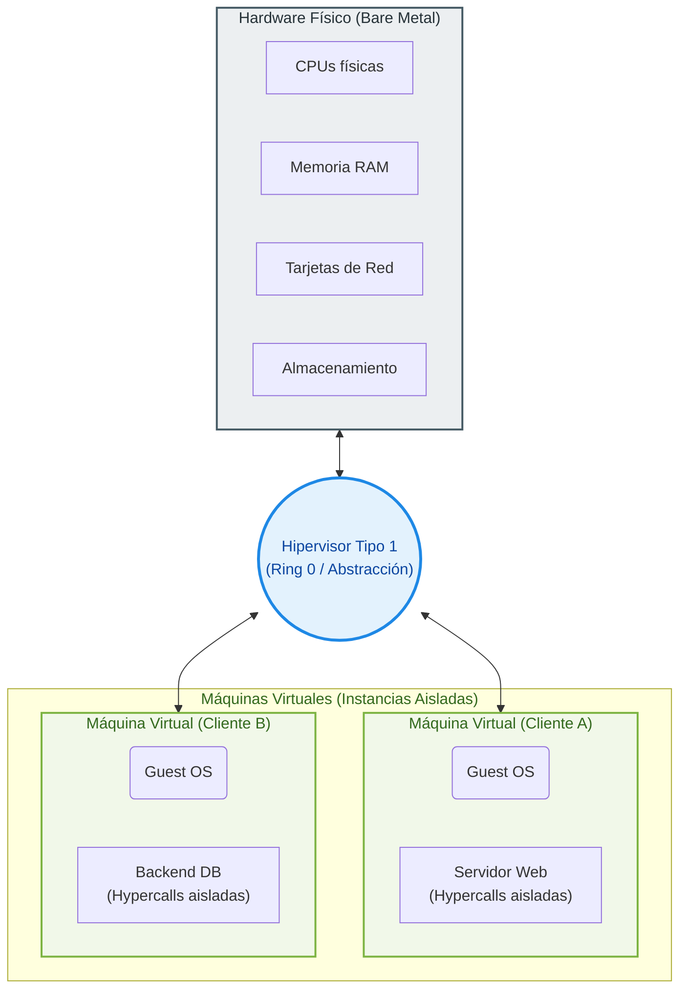

# Módulo 2: Infraestructura Física y Virtualización

**⏱️ Tiempo Estimado:** 20 minutos

**🎯 Objetivos de Aprendizaje:**
*   **Identificar** los componentes físicos críticos de un Centro de Datos moderno y su tolerancia a fallos.
*   **Comprender** cómo la virtualización abstrae los recursos de hardware para permitir el modelo Cloud.
*   **Analizar** la evolución histórica que llevó desde la TI On-Premise hasta la consolidación de los Hyperscalers.

---

## 🚀 Introducción Ejecutiva
A menudo hablamos de "La Nube" como si fuera una entidad incorpórea. Sin embargo, este término es la máxima abstracción operativa creada hasta la fecha. Si escarbas detrás de cada API y arquitectura *serverless*, eventualmente encontrarás metal puro: kilómetros de cables de fibra óptica, enrutadores de terabits, servidores estruendosos y sistemas de enfriamiento industrial.

El viaje hacia la nube comenzó cuando aprendimos a consolidar todo ese pesado hardware a través de software. Este módulo desmitifica lo "invisible", explorando los titánicos Centros de Datos que construyen la nube y desglosando el concepto técnico que lo hace todo posible: **la virtualización.**

---

## 2.1 🏭 Centros de Datos
Un **Data Center (DC)** no es simplemente una "habitación grande con computadoras", sino una obra maestra de ingeniería civil, eléctrica y de red, clasificada típicamente por los estándares Tiers (I al IV) según su tolerancia a fallos. En la escala Cloud, operan los llamados **Hyperscale Datacenters**.

*   **Edificación y Facilidades:**
    *   **Sistemas de Energía Redundante:** Fuentes de energía N+1, respaldadas por baterías UPS (Uninterruptible Power Supply) y generadores diésel industriales para garantizar operatividad 24/7.
    *   **Climatización Adaptativa:** Control extremo de temperatura y humedad mediante pasillos fríos/calientes para disipar el calor generado por miles de CPUs.
    *   **Sistemas de Incendios:** Extinción mediante agentes limpios (gases que no dañan el hardware) y detección temprana de humo.
    *   **Seguridad Física y Monitoreo:** Vigilancia biométrica, cámaras, barreras físicas y centros de control de operaciones (NOC).
*   **Hardware y Redes:**
    *   **Nodos de Cómputo:** Servidores de alta densidad (Rack/Blade) con procesadores multinúcleo y grandes capacidades de vRAM.
    *   **Sistemas de Almacenamiento:** Arreglos masivos (SAN/NAS) basados en discos de estado sólido (All-Flash) para latencias mínimas.
    *   **Infraestructura de Red:** Switches, routers y firewalls de alta velocidad que gestionan el tráfico interno y externo.
    *   **Arquitectura Spine/Leaf:** Topología de red plana que asegura que el tráfico entre cualquier par de servidores (Este-Oeste) mantenga siempre una latencia constante y mínima.

---

## 2.2 🧠 Virtualización y Abstracción
La virtualización es el motor tecnológico indispensable que permite el Cloud Computing. Sin ella, los Centros de Datos serían ineficientes y rígidos.

### 🌀 1. Fundamentos de la Virtualización
Históricamente, el sistema operativo (OS) estaba rígidamente ligado al hardware físico. Esto causaba que un servidor potente promediara apenas un 15% de uso operativo, ya que no se podían mezclar aplicaciones incompatibles en el mismo OS. La virtualización rompe este vínculo mediante la **Abstracción**, permitiendo la **Consolidación** masiva: ejecutar múltiples sistemas independientes sobre un solo recurso físico.

### 🔀 2. Ámbitos de la Virtualización
Aunque solemos pensar solo en servidores, la virtualización ocurre en tres planos críticos en la nube:
*   **Virtualización de Servidores:** Creación de entornos operativos aislados (VMs) sobre hardware físico. Es la base del cómputo cloud.
*   **Virtualización de Red (SDN):** Abstracción de los planos de control y de datos. Permite crear redes, subredes y firewalls mediante software sin tocar cables.
*   **Virtualización de Almacenamiento (SDS):** Gestión de *pools* de datos independiente del hardware físico (discos). Permite que el almacenamiento crezca de forma elástica.

### 💻 3. Máquina Virtual (VM)
La **Máquina Virtual** es un computador definido por software que emula un hardware físico completo de forma aislada.

#### 🛠️ Anatomía Estandarizada
Cada VM se compone de recursos lógicos asignados por el hipervisor:
*   **vCPU y vRAM:** Capacidad de procesamiento y memoria aislada.
*   **vNIC:** Interfaz de red virtual con su propia MAC e IP.
*   **vDisk:** Imagen de disco que el **Guest OS** percibe como almacenamiento físico.

#### 🔄 Gestión del Ciclo de Vida y Seguridad
La virtualización otorga capacidades operativas que el metal puro no posee:
*   **Aislamiento:** Pilar de la seguridad. El fallo o compromiso de una VM no afecta a las vecinas (Sandboxing).
*   **Snapshots:** Capturas de estado que permiten revertir cambios en segundos.
*   **Imágenes de VM:** Plantillas para clonar flotas de servidores idénticos en minutos.

### ⚙️ 4. El Hipervisor
El **Hipervisor**, también conocido como **Virtual Machine Monitor (VMM)**, es la pieza de software más crítica en la arquitectura cloud. Su función principal es actuar como un intermediario entre el hardware físico y las Máquinas Virtuales, gestionando la entrega de recursos (CPU, RAM, Disco) de forma segura y eficiente.

#### Características Clave:
*   **Aislamiento Total:** Garantiza que el software que se ejecuta en una VM no pueda acceder a los datos de otra VM que resida en el mismo host físico.
*   **Gestión de Recursos:** Distribuye dinámicamente el hardware físico según las necesidades de cada instancia virtual.
*   **Privilegio en Ring 0:** Al instalarse directamente sobre el metal (en el Tipo 1), opera con el máximo nivel de control sobre las instrucciones del procesador.

#### ¿Qué son las Hypercalls?
Las **Hypercalls** son el mecanismo fundamental de comunicación entre el sistema operativo invitado (Guest OS) y el hipervisor.
*   **Funcionamiento:** Cuando una VM necesita realizar una operación privilegiada (como escribir en disco o acceder a la red), emite una **Hypercall**. El hipervisor intercepta esta solicitud, la valida para asegurar que la VM no interfiera con otras, y finalmente ejecuta la instrucción en el hardware real.
*   **Importancia:** Es el "lenguaje" que permite que una máquina virtual, que cree estar sola en el hardware, pida permiso al hipervisor para usar los recursos físicos de forma segura.

---

### 🏛️ Tipos de Hipervisor
Dependiendo de dónde se instalan respecto al hardware, se clasifican en dos tipos principales:

*   **Hipervisor Tipo 1 (Nativo/Bare Metal):** Directo sobre el hardware físico. Es la opción de **máximo rendimiento** y eficiencia, siendo el estándar de oro en la nube.
    *   **Ejemplo AWS:** El sistema **AWS Nitro** es el líder indiscutible en esta categoría.

    ```mermaid
    graph BT
        subgraph VM1 ["VM 1"]
            direction BT
            A1["Aplicación"]
            A2["Aplicación"]
            G1["Guest OS"]
            G1 --- A1
            G1 --- A2
        end

        subgraph VM2 ["VM 2"]
            direction BT
            A3["Aplicación"]
            A4["Aplicación"]
            G2["Guest OS"]
            G2 --- A3
            G2 --- A4
        end

        HV["Hipervisor"]
        HW["Hardware"]

        HW --- HV
        HV --- G1
        HV --- G2

        %% Estilos basados en la imagen
        style HW fill:#cccccc,stroke:#333,stroke-width:1px,color:#263238
        style HV fill:#2196f3,stroke:#0d47a1,stroke-width:1px,color:#fff
    ```

*   **Hipervisor Tipo 2 (Hosted):** Corre sobre un sistema operativo convencional. Útil para desarrollo personal (ej: VirtualBox).

    ```mermaid
    graph BT
        subgraph VM_A1 ["VM 1"]
            direction BT
            AppA["Aplicación"]
            GOS1["Guest OS"]
            GOS1 --- AppA
        end

        subgraph VM_A2 ["VM 2"]
            direction BT
            AppB["Aplicación"]
            GOS2["Guest OS"]
            GOS2 --- AppB
        end

        HV2["Hipervisor"]
        Apps["Otras Aplicaciones"]
        HOS["Host OS"]
        HW2["Hardware"]

        HW2 --- HOS
        HOS --- HV2
        HOS --- Apps
        HV2 --- GOS1
        HV2 --- GOS2

        %% Estilos basados en la imagen
        style HW2 fill:#cccccc,stroke:#333,stroke-width:1px,color:#263238
        style HOS fill:#f44336,stroke:#b71c1c,stroke-width:1px,color:#fff
        style HV2 fill:#2196f3,stroke:#0d47a1,stroke-width:1px,color:#fff
        style Apps fill:#3f51b5,stroke:#1a237e,stroke-width:1px,color:#fff
    ```

---

## 2.3 📈 Evolución Hacia la Nube
El salto tecnológico que definió la modernidad no fue instantáneo, sino una evolución del modelo de negocio y control:

1.  **Infraestructura On-Premise (Propiedad):** Las organizaciones compraban y mantenían sus propios servidores. Rigidez física y ciclos de entrega lentos (CapEx pesado).
2.  **Hosting y Colocación (Arrendamiento):** Alquiler de espacio y hardware. Eliminó la gestión física del edificio, pero mantuvo la rigidez del contrato.
3.  **Surgimiento del Modelo Cloud (Consumo):** La era de los **Hyperscalers**. Orquestación masiva mediante APIs y auto-servicio. La infraestructura se vuelve código e industrialización a escala global (OpEx puro).

---

## 2.4 🌐 El Ecosistema de Proveedores de Nube
El mercado de infraestructura cloud ha madurado hacia lo que conocemos como **Hyperscalers**, proveedores con la escala necesaria para ofrecer servicios globales resilientes.

*   **Líderes de Mercado:** Según el **2025 Gartner Magic Quadrant for Strategic Cloud Platform Services**, los líderes indiscutibles que definen el ritmo de la industria son **Amazon Web Services (AWS)**, **Microsoft Azure**, **Google Cloud Platform (GCP)** y **Oracle Cloud Infrastructure (OCI)**.
*   **Jugadores Estratégicos:** El ecosistema se complementa con **IBM Cloud**, y gigantes tecnológicos asiáticos como **Alibaba Cloud**, **Huawei Cloud** y **Tencent Cloud**.

### 🔗 Conexión Lógica: Virtualización como Habilitador
Es fundamental comprender que la virtualización no es solo una "herramienta", sino el cimiento del Cloud. Los Hyperscalers han tomado la capacidad del hipervisor para abstraer hardware y la han automatizado masivamente mediante APIs. Esto permite que la infraestructura sea **elástica, multi-inquilino (*multi-tenant*) y escalable**, transformando el modelo de propiedad (CapEx) en uno de servicio puro (OpEx).

---

## 🖼️ Modelo de Abstracción: Hardware vs. VM
El siguiente diagrama muestra cómo la capa del hipervisor permite a múltiples "vecinos" cohabitar el mismo hardware físico con separación total y segura (*Multi-tenancy*):



---

## 2.5 🔒 Perspectiva de Seguridad: Aislamiento y Multi-tenancy
El Cloud Computing se fundamenta en el principio de **Multi-tenancy** (múltiples inquilinos). Cientos de clientes, posiblemente competidores directos, pueden estar ejecutando sus Máquinas Virtuales sobre la misma placa base física dentro del Data Center del proveedor.

Bajo el **Modelo de Responsabilidad Compartida**:
*   **El proveedor (AWS):** Garantiza la seguridad **DE** la nube. El hipervisor asegura que una VM jamás pueda inspeccionar la RAM o los datos de otra VM vecina mediante el aislamiento en el Ring 0.
*   **El cliente:** Garantiza la seguridad **EN** la nube. Si dejas puertos abiertos o usas software vulnerable dentro de tu Guest OS, el aislamiento del hipervisor no te protegerá de ataques a nivel de aplicación.

---

> [!IMPORTANT]
> ## 💡 Conceptos Críticos
> *   **Hyperscaler:** Proveedores masivos (AWS, Azure, GCP) que ofrecen infraestructura planetaria bajo demanda.
> *   **On-Premise:** Infraestructura en instalaciones propias del cliente (Modelo de Propiedad / CapEx).
> *   **SLA (Service Level Agreement):** Compromiso de disponibilidad (ej. 99.99%) vinculado a la robustez del Data Center.
> *   **Ring 0:** El nivel de privilegio más profundo del hardware donde reside el hipervisor para gestionar el sistema.
> *   **Hypercall:** Mecanismo por el cual una VM solicita recursos al hipervisor de forma controlada.
> *   **Multi-tenancy:** Capacidad de compartir hardware físico entre múltiples clientes con aislamiento lógico total.
> *   **Snapshot:** Captura de estado de una VM que permite su recuperación inmediata ante fallos.

---

## 🛠️ Ejemplo Práctico: Caso Real
**De Ciclos de Compra a Elasticidad en Minutos:** Un comercio minorista tradicional solía comprar servidores físicos (CapEx) con meses de antelación para eventos como el *Cyber Monday*. Esto resultaba en hardware ocioso el 90% del año.

Al migrar a AWS basándose en la **Virtualización**, el minorista pasó a un modelo **OpEx**. Durante el pico de tráfico, el sistema orquesta automáticamente la creación de cincuenta nuevas Máquinas Virtuales (instancias) en cuestión de minutos. Una vez pasada la demanda, estas se eliminan, pagando solo por las horas de uso efectivo y eliminando el desperdicio de capital.

---

## 🗣️ Discusión Sistémica
**¿Cuándo falla lo invisible?** Aunque la virtualización nos hace creer que el hardware no importa, un fallo eléctrico total en un Data Center (a pesar de los UPS y generadores) "apagaría" instantáneamente todas las nubes virtuales de ese sitio. 
**Pregunta:** Si tu infraestructura es 100% virtualizada, ¿cómo diseñarías tu arquitectura para que tu servicio siga vivo incluso si un Data Center completo desaparece físicamente? (Pista: Lo veremos en el diseño Multizona).

---

## 🧠 Puntos de Retención
*   **El metal importa:** La nube corre sobre infraestructura física colosal con redundancia extrema.
*   **Virtualización:** Rompe el vínculo entre Software y Hardware permitiendo la elasticidad y el modelo de pago por uso.
*   **Aislamiento:** El hipervisor en el Ring 0 es el guardián que permite que extraños compartan el mismo servidor físico con seguridad.

---

## ✅ Criterios de Éxito
- [ ] ¿Puedo explicar cómo los sistemas redundantes de un DC protegen mi infraestructura virtual?
- [ ] ¿Distingo claramente entre el modelo CapEx (On-premise) y el modelo OpEx (Cloud)?
- [ ] ¿Comprendo el rol del Ring 0 y las Hypercalls en el aislamiento de seguridad?
- [ ] ¿Identifico a los líderes del Gartner Magic Quadrant 2025 y por qué se les llama Hyperscalers?
- [ ] ¿Entiendo cómo la virtualización permitió el nacimiento del modelo cloud industrializado?
