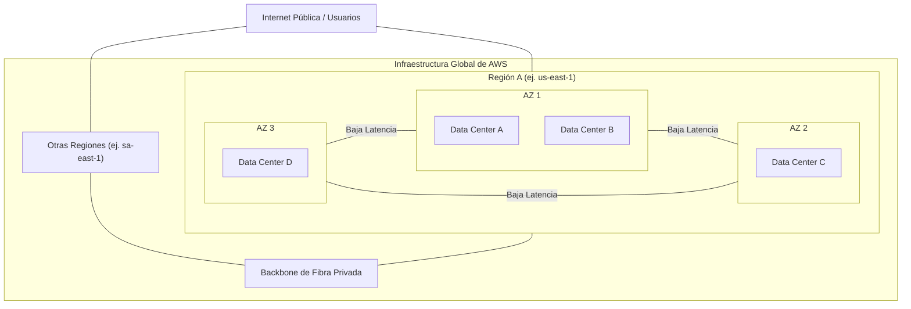
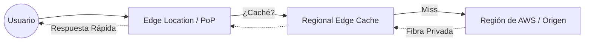

# Módulo 4 - Infraestructura Global y Acceso a Servicios

## 📅 Metadatos y Objetivos
- **Tiempo estimado:** 20 minutos (RF-02)
- **Audiencia:** Estudiantes de TI con bases en redes y virtualización (NRF-1).
- **Objetivos de aprendizaje:**
    - Comprender la arquitectura física y lógica de la **Infraestructura Global de AWS**.
    - Diferenciar entre Regiones, Zonas de Disponibilidad y servicios globales.
    - Aplicar criterios de diseño para la **Alta Disponibilidad (HA)** y Tolerancia a Fallos.
    - Identificar las herramientas de acceso (Consola, CLI, SDK, IaC).

---

## 🚀 Introducción Ejecutiva
AWS no es simplemente "el servidor de alguien más". Es una red masiva de centros de datos de grado industrial distribuidos por todo el planeta, interconectados por una de las redes de fibra oscura más veloces del mundo. Entender cómo se organiza esta infraestructura es el primer paso para diseñar sistemas que nunca duermen.

---

## 4.1 🌐 La Infraestructura Global de AWS

### 🌐 0. Acceso como Nube Pública
Como **Nube Pública**, el punto de entrada inicial para cualquier usuario o aplicación es la **Internet Pública**. 
*   **Endpoints Regionales:** Cada servicio en una región cuenta con puntos de acceso públicos (URL) a los que te conectas desde tu red local o ISP.
*   **Transición a la Red de AWS:** Tan pronto como tu tráfico "toca" un punto de entrada de AWS (ya sea un endpoint regional o una Edge Location), este abandona la red pública y se traslada al **Backbone Privado** de AWS.
*   **Integración Sistémica:** Este diseño permite que AWS sea universalmente accesible conservando una infraestructura interna aislada y segura, donde el backbone se encarga de la comunicación privada entre Regiones y Zonas de Disponibilidad.

### 🕸️ 1. El Backbone Global
A diferencia de otros proveedores que dependen de la Internet pública, AWS ha diseñado una infraestructura de red para la **resiliencia sistémica** mediante un **Backbone de Red de Fibra Privada** mundial.
*   **Aislamiento de la Red Pública:** Al evitar la Internet pública, AWS reduce drásticamente los puntos de fallo, la latencia y los vectores de ataque (DDoS).
*   **Entrega de Servicios Globales:** Este tejido de fibra es el responsable de replicar instantáneamente las configuraciones de servicios globales (como IAM o Route 53) en todo el planeta, garantizando que el plano de control sea altamente resiliente.

### 📍 2. Regiones de AWS
Una **Región** es un área geográfica aislada que agrupa toda la infraestructura necesaria para operar de forma autónoma.
*   **Aislamiento Geográfico:** Cada región está separada por cientos o miles de kilómetros, asegurando que desastres a gran escala no afecten a más de una región.
*   **Nomenclatura Estandarizada:** AWS utiliza una nomenclatura técnica lógica (ej. `us-east-1` para Norte de Virginia, `sa-east-1` para São Paulo) que facilita la gestión mediante código (IaC).
*   **Servicios Globales vs Regionales:** Es vital distinguir que los servicios regionales (EC2, S3) viven en el silo de una región, mientras que los globales tienen un alcance mundial nativo.

### ⚡ 3. Zonas de Disponibilidad (AZ)
Dentro de cada Región, AWS despliega múltiples **Zonas de Disponibilidad (Availability Zones)**.
*   **Arquitectura de Clúster:** Una AZ no es un servidor; es uno o más **clústeres de centros de datos** discretos.
*   **Independencia de Facilidades:** Cada AZ cuenta con suministro eléctrico, climatización, subestaciones y red de datos totalmente independientes.
*   **Interconexión de Alta Velocidad:** Están unidas por red de **Fibra de Alta Velocidad (High-speed Fiber)** y ultra-baja latencia, lo que permite el diseño de aplicaciones distribuidas que parecen estar en el mismo lugar físico.

### 🛡️ 4. Diseño para el Fallo: Multi-AZ
Basado en el principio de que *"Todo falla, todo el tiempo"*, AWS permite implementar **Estrategias de Alta Disponibilidad** mediante la replicación de cargas de trabajo.
*   **Tolerancia a Fallos (Fault Tolerance):** Al replicar datos y cómputo entre AZs aisladas, el sistema puede absorber la caída total de un centro de datos (o una zona entera) sin interrupción del servicio.
*   **Replicación de Cargas:** Permite el movimiento síncrono de datos entre zonas, asegurando que el estado de la aplicación sea idéntico en todos los nodos.

> [!IMPORTANT]
> **La Replicación NO es automática por defecto:**
> Aunque AWS proporciona la infraestructura para la alta disponibilidad, **es tu responsabilidad configurar la replicación**. 
> - Si creas una instancia EC2 en la AZ-1, AWS **no la copiará** a la AZ-2 automáticamente. 
> - Si guardas datos en un disco EBS, estos solo viven en una AZ específica.
> - Solo ciertos servicios (como **Amazon S3** o **DynamoDB**) incorporan replicación Multi-AZ de forma nativa por defecto. Para lo demás, debes diseñar y configurar arquitecturas Multi-AZ activamente.

### ⚖️ 5. Criterios para elegir una Región
La selección de la región es una decisión crítica de arquitectura basada en 4 factores:
1.  **Residencia de Datos (Gobernanza):** El cumplimiento de leyes locales que prohíben que los datos (especialmente financieros o médicos) salgan del territorio nacional.
2.  **Latencia del Usuario Final:** Situar los recursos físicamente cerca de los clientes para minimizar los tiempos de respuesta.
3.  **Disponibilidad de Servicios:** Verificar que los servicios específicos (o tipos de instancias) estén habilitados en esa región.
4.  **Costos Regionales:** Estructura de precios variable según impuestos, costos de energía y logística local.

---

## 🖼️ Visualización: Jerarquía de Infraestructura Global (NRF-9)

---

## 4.2 ⚡ Infraestructura de Borde (Edge Infrastructure)

### 🌎 1. El Concepto de "Borde"
El **Edge Computing (Computación en el Borde)** consiste en acercar el procesamiento y los datos lo más posible al usuario final.
*   **Velocidad de la luz:** Aunque la fibra es rápida, la distancia física genera latencia. El borde elimina milisegundos críticos al procesar datos "en la puerta de la casa" del usuario.
*   **Seguridad:** El borde es la primera línea de defensa, permitiendo filtrar ataques antes de que lleguen a tu infraestructura principal en la Región.

### 🗼 2. Edge Locations (PoPs)
Los **Puntos de Presencia (Points of Presence - PoP)** son pequeños centros de datos de AWS ubicados en grandes ciudades de todo el mundo.
*   **Entrega de Contenido:** Almacenan copias de tus archivos (imágenes, videos) para entregarlos localmente.
*   **Seguridad Perimetral:** Aquí residen servicios como **AWS Shield** y **AWS WAF**, protegiendo tu aplicación contra ataques de denegación de servicio (DDoS).

### 📦 3. Regional Edge Caches
Es una capa intermedia de almacenamiento ubicada entre las Edge Locations y tu Región de AWS.
*   **Origin Offload:** Ayuda a que tu servidor principal (el Origen) no colapse bajo miles de peticiones. Si un archivo no está en una Edge Location, se busca en el Regional Cache antes de ir hasta la Región.
*   **Mayor Hit Rate:** Mejora las probabilidades de que el usuario encuentre el contenido rápidamente sin viajar miles de kilómetros.

### 🔗 4. Conectividad de Borde
Todas las Edge Locations están unidas directamente al **Backbone Global de AWS**.
*   **Rutas Optimizadas:** En lugar de viajar por múltiples proveedores de Internet asumiendo riesgos de congestión, el tráfico entra a la red de AWS en el PoP más cercano y viaja por fibra privada y segura hasta el destino.

### ☁️ 5. Amazon CloudFront
Es el servicio de **Red de Entrega de Contenido (Content Delivery Network - CDN)** de AWS.
*   **Orquestador:** CloudFront utiliza toda la infraestructura de borde mencionada anteriormente para distribuir datos, videos, aplicaciones y APIs a usuarios de todo el mundo con baja latencia y alta velocidad de transferencia.

---

## 🖼️ Visualización: Flujo de Tráfico desde el Borde (NRF-10)

---

> [!NOTE]
> **El Hilo Conector:** En el Módulo 2 vimos cómo un centro de datos tiene redundancia N+1. En AWS, esa redundancia se eleva a nivel geográfico: la Región es el concepto que agrupa esa capacidad industrial para ofrecer resiliencia global.

---

## 💡 Conceptos Críticos
*   **Backbone:** La "columna vertebral" de fibra rápida de AWS.
*   **Multi-AZ:** Estrategia de distribuir recursos en al menos dos AZs para alta disponibilidad.
*   **High-speed Fiber:** El tejido conectivo que hace que las AZs funcionen como un solo clúster.
*   **Residencia de Datos:** El cumplimiento legal sobre la ubicación física del dato.

---

## 🔒 Perspectiva de Seguridad: Aislamiento Regional
Desde el diseño, AWS garantiza que **ningún dato se mueva de una región a otra** a menos que tú lo configures explícitamente. Esto es una capa de seguridad fundamental contra el acceso no autorizado a nivel de jurisdicción legal.

---

## 🛠️ Ejemplo Práctico: Resiliencia ante Desastres
Imagina una aplicación bancaria crítica operando en la región de **sa-east-1** (São Paulo).
1.  **Arquitectura:** Se utilizan dos instancias de servidor en **AZ 1** y **AZ 2**, y una base de datos con **Replicación Síncrona**.
2.  **Evento Disruptivo:** Un fallo masivo en la red eléctrica deja inoperativa a toda la **AZ 1** (incluyendo el centro de datos principal).
3.  **Proceso de Failover:**
    *   **Detección:** El sistema de monitoreo detecta la caída en milisegundos.
    *   **Redirección:** El DNS (Amazon Route 53) deja de enviar tráfico a la AZ 1 y lo dirige 100% a la **AZ 2**.
    *   **Promoción:** La base de datos "esclava" en la AZ 2 se convierte en "maestra".
4.  **Resultado:** Los usuarios finales no perciben la caída. El negocio mantiene su disponibilidad (**RTO cercano a cero**) y no hay pérdida de datos (**RPO de cero**) debido a la replicación previa entre zonas aisladas.

---

## 🗣️ Discusión Sistémica: La Ilusión del Aislamiento
**¿Es 100% seguro el aislamiento de las AZs?**
Aunque las AZs tienen infraestructuras independientes, a menudo comparten la misma cuenca hidrográfica (para enfriamiento) o la misma zona sísmica.
**Pregunta:** Si un desastre natural escala a nivel regional (ej. un gran terremoto o inundación masiva), ¿sería suficiente una arquitectura Multi-AZ? ¿En qué momento el costo de una arquitectura **Multi-Región** justifica el beneficio?

---

---

## 4.3 🛠️ Extensiones y Acceso (Extensions & Access)

### 🏗️ 1. AWS Outposts
**AWS Outposts** permite ejecutar servicios de AWS de forma nativa en tu propio centro de datos.
*   **Consistencia:** Utilizas las mismas APIs, herramientas y hardware que en la nube pública.
*   **Caso de uso:** Aplicaciones que requieren procesamiento local debido a latencia de microsegundos o residencia de datos estricta en sitio.

### 🏙️ 2. AWS Local Zones
Son extensiones de una Región de AWS que sitúan el cómputo y almacenamiento cerca de grandes centros urbanos.
*   **Metro-Edge Latency:** Diseñadas para aplicaciones de alta demanda (ej. renderizado de video, juegos en línea) en ciudades donde no hay una Región completa.

### 📡 3. AWS Wavelength
Optimizado para el **Mobile Edge Computing (MEC)**.
*   **Redes 5G:** Despliega infraestructura de AWS directamente dentro de las redes 5G de los proveedores de telecomunicaciones.
*   **Ultra-baja latencia:** Ideal para dispositivos móviles, vehículos autónomos y aplicaciones de realidad aumentada.

### 💻 4. Métodos de Interacción con AWS
Para gestionar estos recursos, AWS ofrece cuatro caminos principales:

#### 🖱️ A. Consola de Administración
Interfaz web intuitiva y visual. Ideal para principiantes, exploración de servicios rápidos y visualización de dashboards de costos y salud.

#### 🐚 B. AWS CLI y CloudShell
*   **CLI (Command Line Interface):** Permite controlar servicios mediante comandos en tu terminal. Fundamental para automatizar tareas repetitivas.
*   **CloudShell:** Una terminal basada en navegador que ya tiene la CLI instalada y configurada con tus permisos, eliminando la necesidad de instalar nada localmente.

#### 📜 C. SDKs y APIs
*   **APIs:** Todo en AWS es una llamada a una API REST.
*   **SDKs (Software Development Kits):** Librerías para lenguajes específicos (Python, Java, JS, Go). Permiten que tu código "hable" con AWS de forma nativa para crear buckets, subir archivos o lanzar servidores.

#### 🤖 D. Infraestructura como Código (IaC)
Es el paradigma de gestión moderna donde defines tu infraestructura en archivos de texto.
*   **Declarativo:** No dices "crea un servidor", dices "mi sistema debe tener un servidor".
*   **Herramientas:** **AWS CloudFormation** (nativo), **AWS CDK** (usando lenguajes de programación) y **Terraform** (multi-nube).

---

> [!TIP]
> **Evolución del Perfil:** Como vimos en el Módulo 1, el **Cloud Engineer** domina la CLI y la IaC, mientras que el **Cloud Developer** se apoya en los SDKs para construir aplicaciones inteligentes.

---

## 🛠️ Ejemplo Práctico: Ciclo de Vida de una Web App
Para entender cómo interactúan las herramientas de acceso, sigamos el despliegue de una tienda online:
1.  **Diseño Automático (IaC):** El Arquitecto de Cloud escribe un archivo de **Terraform** que define una red, 3 servidores y un balanceador. Esto garantiza que el entorno de "Pruebas" sea idéntico al de "Producción".
2.  **Operación Rápida (CLI):** Un Desarrollador nota que un servidor necesita un reinicio rápido. En lugar de navegar por 5 menús en la consola, ejecuta `aws ec2 reboot-instances` desde su terminal **CloudShell** en segundos.
3.  **Lógica del Negocio (SDK):** Cuando un cliente sube una foto de su recibo de pago, el código de la tienda (escrito en **Java**) usa el **SDK de AWS** para depositar ese archivo en un bucket de S3 sin que el desarrollador tenga que programar la conexión de red manualmente.
4.  **Auditoría y Costos (Consola):** El Gerente de TI entra una vez a la semana a la **Consola de Administración** para revisar visualmente las gráficas de consumo y el dashboard de facturación para asegurar que el presupuesto no se exceda.

---

## 🗣️ Discusión Sistémica: La Evolución de la Interfaz
**¿Muerte de la Consola de Administración?**
En entornos de producción masivos, tocar botones en la consola es propenso a errores humanos, es difícil de auditar ("¿quién cambió este parámetro?") y no es escalable. 
**Preguntas para el debate:**
1.  ¿En qué escenarios (ej. Debugging de emergencia o exploración de nuevos servicios) la Consola sigue siendo superior a la IaC?
2.  ¿Cómo afecta el uso de la Consola a la capacidad de una empresa para recuperarse ante un desastre si debe "rebuild" toda su infraestructura desde cero?

---

## 🧠 Puntos de Retención
*   **Outposts, Local Zones y Wavelength** extienden la nube a donde la latencia lo requiera.
*   La **Consola** es para aprender y ver; la **CLI e IaC** son para operar y escalar.
*   Los **SDKs** permiten que las aplicaciones utilicen la potencia de AWS mediante código.

---

## ✅ Criterios de Éxito

**Global (4.1)**
- [ ] ¿Puedo explicar la diferencia entre una AZ, una Región y un servicio global de AWS?
- [ ] ¿Entiendo por qué el backbone privado de AWS es más seguro y rápido que la Internet pública?
- [ ] ¿Sé cuáles son los 4 factores para elegir una región y puedo priorizarlos según el contexto?
- [ ] ¿Comprendo que la replicación entre AZs NO ocurre automáticamente en la mayoría de los servicios?

**Borde (4.2)**
- [ ] ¿Puedo describir el recorrido de una petición de usuario desde Internet hasta la Región de AWS pasando por un PoP?
- [ ] ¿Distingo el rol de un Edge Location vs. un Regional Edge Cache?
- [ ] ¿Entiendo en qué escenarios CloudFront aporta valor real frente a servir directamente desde la Región?

**Extensiones y Acceso (4.3)**
- [ ] ¿Puedo diferenciar los casos de uso de Outposts, Local Zones y Wavelength?
- [ ] ¿Puedo nombrar y comparar las 4 formas de interactuar con AWS (Consola, CLI, SDK, IaC)?
- [ ] ¿Entiendo por qué la IaC es superior a la Consola para despliegues repetibles y recuperación ante desastres?
