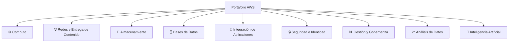
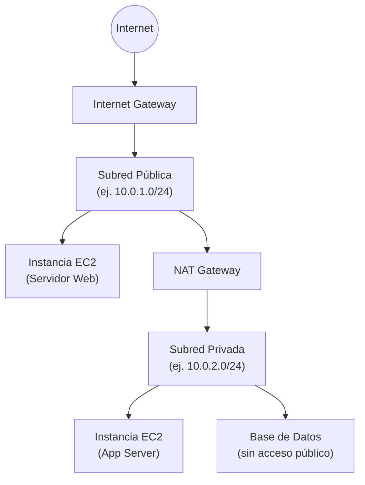
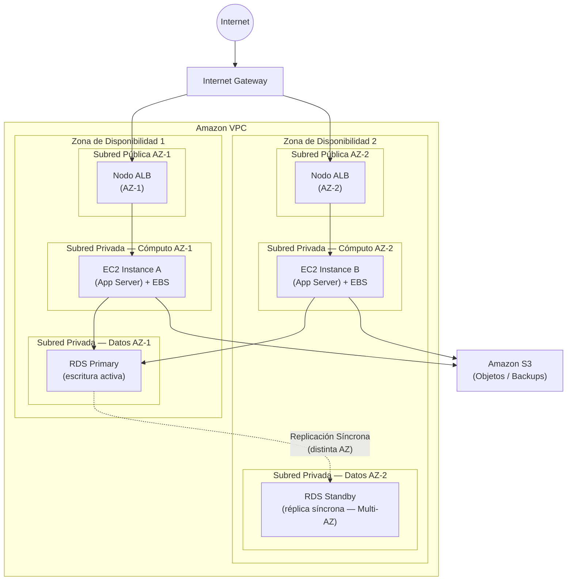

# Módulo 05 - Servicios Principales de AWS

## 📅 Metadatos y Objetivos
- **Tiempo estimado:** 20 minutos
- **Audiencia:** Estudiantes de TI con bases en redes y virtualización.
- **Objetivos de aprendizaje:**
    - Comprender cómo AWS organiza su portafolio en **dominios funcionales** y por qué esa estructura importa para diseñar soluciones.
    - Identificar las **características y propósito** de cada categoría de servicios.
    - Seleccionar la categoría de servicio correcta según el problema técnico a resolver.
    - Reconocer los servicios fundamentales de AWS y su rol en una arquitectura típica de referencia.

---

## 🚀 Introducción Ejecutiva
En el Módulo 4 aprendimos *dónde* vive AWS: Regiones, AZs, PoPs. Ahora llega la pregunta crucial: ¿*qué* ofrece AWS en esa infraestructura? La respuesta es un catálogo de más de 200 servicios agrupados en dominios funcionales. Conocer esa jerarquía es el mapa mental que permite a un ingeniero traducir cualquier problema de negocio en una solución técnica concreta.

---

## 5.1 🗂️ Categorías de Servicios de AWS

### 🧩 0. La Jerarquía del Portafolio (FR-43)
El portafolio de AWS no es una lista plana de herramientas; es una **arquitectura de dominos funcionales**. Cada categoría agrupa servicios que resuelven un mismo tipo de problema técnico, lo que permite:
*   **Diseñar por capas:** Seleccionar el servicio correcto en cada capa de una arquitectura (datos, cómputo, red, seguridad).
*   **Navegar el catálogo:** Evitar la parálisis ante más de 200 servicios disponibles, encontrando rápidamente el dominio relevante.

---

### ⚙️ 1. Cómputo (FR-44)
La categoría de **Cómputo** agrupa todos los servicios que proveen **capacidad de procesamiento**. Representa la evolución del servidor físico del Módulo 2, ahora consumido como un servicio bajo demanda.

Existen tres modelos fundamentales, diferenciados por el nivel de control que el usuario retiene sobre el entorno de ejecución:

| Modelo | Descripción | Control del usuario | Factor de elección |
| :--- | :--- | :--- | :--- |
| **Instancias Virtuales** | Máquinas virtuales configurables con OS completo | Máximo (OS, software, red) | Necesito control total o migrar apps existentes |
| **Contenedores** | Unidades de despliegue portables que encapsulan la app y sus dependencias, aisladas entre sí | Medio (app + runtime) | Portabilidad, microservicios, consistencia entre entornos |
| **Ejecución Basada en Eventos** | Código que se ejecuta en respuesta a un evento sin aprovisionar ni gestionar servidores | Mínimo (solo el código) | Tareas intermitentes, arquitecturas reactivas, costo optimizado por invocación |

> [!TIP]
> **Hilo Conector:** En el Módulo 2 vimos que la virtualización abstrae el hardware. Las instancias virtuales en la nube son esa misma abstracción expuesta como servicio. Los contenedores van un paso más allá: abstraen el sistema operativo.

---

### 🌐 2. Redes y Entrega de Contenido (FR-45)
La categoría de **Redes** provee los servicios que permiten **definir, controlar y optimizar la conectividad** entre todos los demás recursos de una arquitectura.

Sus funciones clave incluyen:
*   **Redes Virtuales Privadas:** Permiten construir un espacio de red lógicamente aislado dentro de la nube, donde el usuario controla el rango de IPs, las subredes y las rutas de tráfico, replicando el modelo de red de un centro de datos propio.
*   **Interconexión Segura:** Servicios que permiten unir recursos de diferentes redes, redes privadas con Internet o nubes con centros de datos on-premise mediante conexiones cifradas.
*   **Resolución Global de DNS:** La traducción de nombres de dominio a IPs, gestionada a escala mundial con enrutamiento inteligente basado en latencia, geolocalización o estado de salud de los endpoints.
*   **Entrega Acelerada de Contenido:** Utilizando la infraestructura de borde del Módulo 4 (PoPs), estos servicios aceleran la entrega de aplicaciones, APIs y contenido estático a los usuarios finales con mínima latencia.

---

### 💾 3. Almacenamiento (FR-46)
La categoría de **Almacenamiento** provee soluciones de persistencia de datos bajo tres paradigmas técnicos distintos, cada uno optimizado para un patrón de acceso diferente:

| Paradigma | Descripción | Característica Clave |
| :--- | :--- | :--- |
| **Objeto** | Los datos se almacenan como unidades discretas (objetos) compuestas por el dato, metadatos y un identificador único. Acceso vía HTTP/S. | Durabilidad extrema, escalabilidad ilimitada, costo bajo para grandes volúmenes. Ideal para backups, multimedia, Data Lakes. |
| **Bloque** | El almacenamiento se divide en bloques de tamaño fijo, accedidos directamente por el sistema operativo como si fuera un disco físico. | Baja latencia (sub-milisegundo), esencial para bases de datos y sistemas de archivos de alto rendimiento. |
| **Sistema de Archivos** | Interfaz familiar de directorio/archivo compartida entre múltiples recursos de cómputo simultáneamente. | Acceso concurrente, ideal para aplicaciones que requieren un sistema de archivos compartido (CMS, HPC). |

> [!NOTE]
> **Criterio de selección:** La pregunta clave no es "¿cuál es más grande?" sino "¿cómo accede la aplicación al dato?". Un disco para una base de datos → Bloque. Un repositorio de imágenes accedido por HTTP → Objeto. Un sistema de archivos compartido entre varios servidores → Archivos.

---

### 🗄️ 4. Bases de Datos (FR-47)
La categoría de **Bases de Datos** provee sistemas de almacenamiento y consulta de datos **gestionados por AWS**: el proveedor se encarga de las tareas operativas (parches del motor, backups, alta disponibilidad), mientras el usuario se enfoca en el diseño del esquema y las consultas.

El criterio de clasificación más fundamental divide los sistemas en dos grandes familias:

**Relacionales (SQL):**
*   Organizan los datos en tablas con filas y columnas, con relaciones explícitas entre ellas definidas por un esquema.
*   Garantizan la integridad mediante propiedades **ACID** (Atomicidad, Consistencia, Aislamiento, Durabilidad).
*   Ideales para datos estructurados, transacciones bancarias, ERPs y aplicaciones web clásicas.

**No Relacionales (NoSQL):**
*   No exigen un esquema rígido. Pueden modelar datos como documentos, pares clave-valor, grafos o columnas amplias.
*   Prioriza el **rendimiento y la escalabilidad horizontal** sobre la consistencia estricta (modelo de consistencia eventual).
*   Ideales para cargas de trabajo masivas con patrones de acceso predecibles: juegos, IoT, carritos de compra, sesiones.

---

### 🔗 5. Integración de Aplicaciones (FR-48)
Conforme una arquitectura crece, sus componentes deben comunicarse sin depender directamente los unos de los otros. Esta categoría provee los servicios de **mensajería y eventos** que hacen posible el **desacoplamiento**.

*   **¿Qué es el desacoplamiento?** Un sistema está acoplado cuando el fallo o la lentitud de un componente afecta directamente a los otros. Desacoplarlos significa que la comunicación ocurre de forma **asíncrona**: el emisor envía un mensaje y continúa su trabajo sin esperar una respuesta inmediata.
*   **Colas de Mensajes:** Un componente produce mensajes que son almacenados en una cola hasta que el componente consumidor está listo para procesarlos. Garantizan que ningún mensaje se pierda aunque el consumidor esté saturado.
*   **Publicación / Suscripción (Pub/Sub):** Un productor publica un evento en un canal, y múltiples consumidores suscritos a ese canal lo reciben simultáneamente. Permite un modelo de comunicación de uno-a-muchos sin que el productor conozca a los suscriptores.
*   **Buses de Eventos (Event-Driven):** Infraestructura para enrutar eventos desde múltiples fuentes hacia múltiples destinos, aplicando reglas de filtrado y transformación. Es el corazón de las arquitecturas orientadas a eventos.

---

### 🔒 6. Seguridad e Identidad (FR-49)
Esta categoría es transversal a todas las demás: no es una capa que se añade al final, sino un principio que se diseña desde el primer recurso. Sus tres pilares son:

*   **Gestión de Identidades y Acceso Granular:** El sistema que define *quién* (usuarios humanos, aplicaciones, servicios) puede realizar *qué acción* sobre *qué recurso* bajo *qué condición*. El principio rector es el **Menor Privilegio**: cada entidad tiene exactamente los permisos que necesita, ni uno más.
*   **Cifrado de Datos:**
    *   **En tránsito:** Proteger los datos mientras viajan por la red mediante protocolos como TLS.
    *   **En reposo:** Proteger los datos almacenados utilizando claves de cifrado gestionadas de forma centralizada y auditable.
*   **Protección de la Infraestructura:** Servicios que inspeccionan el tráfico de red en busca de patrones maliciosos y mitigan automáticamente ataques volumétricos (DDoS) antes de que lleguen a la aplicación.

> [!IMPORTANT]
> Como se vio en el Módulo 3, el **Modelo de Responsabilidad Compartida** delimita qué protege AWS ("de la nube") y qué es responsabilidad del cliente ("en la nube"). Esta categoría provee las herramientas para cumplir con la parte del cliente.

---

### 📊 7. Gestión y Gobernanza (FR-50)
No puedes gestionar lo que no puedes ver. Esta categoría provee la **observabilidad operativa** y las herramientas de **cumplimiento** para operar plataformas en producción con confianza.

*   **Observabilidad (Métricas, Logs, Trazas):** Recolección y análisis en tiempo real del comportamiento de los recursos (uso de CPU, errores, tiempos de respuesta). Permite definir alarmas para reaccionar ante anomalías antes de que se conviertan en incidentes.
*   **Auditoría de Acciones:** Registro inmutable de cada llamada a la API realizada en la plataforma: *quién* hizo *qué*, *cuándo* y *desde dónde*. Fundamental para la investigación de incidentes de seguridad y el cumplimiento regulatorio.
*   **Conformidad de Configuración:** Verificación automatizada de que los recursos cumplen con las políticas definidas por la organización (ej. "todos los buckets de almacenamiento deben estar cifrados"). Genera reportes de cumplimiento y puede remediar desviaciones automáticamente.

---

### 📈 8. Análisis de Datos (FR-51)
Cuando el volumen de datos supera la capacidad de una base de datos transaccional tradicional, esta categoría provee la infraestructura para construir **plataformas de datos a escala**.

*   **Data Lake:** Repositorio centralizado que almacena datos en su formato original (estructurado, semiestructurado y no estructurado) a escala masiva y bajo costo. Es la "materia prima" de la plataforma analítica.
*   **Procesamiento Batch:** Transformación de grandes conjuntos de datos de manera periódica (por ejemplo, cada noche) mediante pipelines **ETL** (Extracción, Transformación, Carga) que preparan los datos para su análisis.
*   **Procesamiento en Streaming (Tiempo Real):** Ingesta y análisis de flujos continuos de datos generados por eventos en tiempo real (sensores IoT, logs de aplicación, transacciones). Permite detectar patrones y tomar decisiones en milisegundos.
*   **Data Warehouse:** Almacén de datos estructurado y optimizado para consultas analíticas complejas (*OLAP*) sobre grandes volúmenes históricos. Alimentado por los pipelines ETL desde el Data Lake.

---

### 🤖 9. Inteligencia Artificial y Machine Learning (FR-52)
Esta categoría democratiza el acceso a la inteligencia artificial, eliminando la necesidad de construir infraestructura de ML desde cero.

*   **Entrenamiento de Modelos:** Plataformas que proveen el entorno integrado (cómputo de GPU, almacenamiento, herramientas de experimentación) para el ciclo completo de vida de un modelo de ML: preparación de datos, entrenamiento, evaluación y despliegue.
*   **Inferencia:** Servicios que alojan modelos ya entrenados y los exponen como APIs para que las aplicaciones puedan realizar predicciones bajo demanda o en tiempo real.
*   **Servicios Pre-entrenados:** APIs listas para usar que resuelven problemas específicos sin necesidad de entrenar un modelo propio: análisis de imágenes (visión por computadora), procesamiento de lenguaje natural (sentimientos, entidades), transcripción de voz y traducción.
*   **IA Generativa y Agentes:** Plataformas de acceso a modelos de lenguaje masivos (LLMs) para construir aplicaciones generativas (chatbots, generación de contenido, resumen) y agentes autónomos que razonan y ejecutan tareas en múltiples pasos.

---

> [!NOTE]
> **Hilo Conector:** En el Módulo 3, vimos que IaaS, PaaS y SaaS representan distintos niveles de abstracción. Las categorías de Cómputo e Infraestructura de Red son típicamente IaaS. Las Bases de Datos, la Integración y **los servicios de IA Pre-entrenada** que consume un desarrollador como bloques de construcción para su propia aplicación se alinean mejor con el modelo **PaaS**: el proveedor gestiona todo por debajo (datos de entrenamiento, modelo, infraestructura de inferencia) y tú consumes capacidades vía API para construir algo propio. Sin embargo, si el mismo servicio de IA es consumido directamente por un usuario final como aplicación completa, el modelo se acercaría más a SaaS. La frontera es difusa, y por eso la industria ha comenzado a usar otros términos para reconocer que algunos servicios no encajan perfectamente en la taxonomía NIST original de 2011.

---

## 💡 Conceptos Críticos
*   **Portafolio por Dominios:** AWS agrupa servicios por el problema técnico que resuelven, no por tecnología interna.
*   **Instancias / Contenedores / Eventos:** Los tres modelos de ejecución de código, en orden descendente de control del OS.
*   **Objeto / Bloque / Archivos:** Los tres paradigmas del almacenamiento, diferenciados por su patrón de acceso.
*   **SQL vs NoSQL:** Integridad transaccional (ACID) vs. escala y velocidad (consistencia eventual).
*   **Desacoplamiento:** La capacidad de que los componentes de una aplicación se comuniquen de forma asíncrona y sin dependencias directas.
*   **Data Lake vs Data Warehouse:** Repositorio crudo de datos vs. almacén optimizado para consultas analíticas.
*   **Menor Privilegio:** Ninguna identidad debe tener más permisos de los estrictamente necesarios para su función.

---

## 🔒 Perspectiva de Seguridad: La Seguridad es una Categoría Transversal
La categoría de Seguridad e Identidad no se usa aisladamente sino que se integra con cada una de las demás:
*   **Cómputo:** Las instancias y funciones asumen **roles de acceso** para interactuar con otros servicios (sin credenciales hardcodeadas).
*   **Almacenamiento:** Los datos se cifran en reposo usando el servicio de gestión de claves.
*   **Redes:** El tráfico entre subredes se controla mediante reglas de permitir/denegar en firewalls virtuales.
*   **Gestión:** La auditoría registra cada acción, incluyendo los cambios en las políticas de seguridad.

---

## 🛠️ Ejemplo Práctico: Eligiendo las Categorías para una Startup SaaS
Una startup construye una plataforma de análisis de videollamadas para equipos de ventas:
1.  **Cómputo (Instancias Virtuales):** El servidor de API que recibe y gestiona las videollamadas necesita control del OS y baja latencia: instancias virtuales.
2.  **Cómputo (Basado en Eventos):** La transcripción automática de cada grabación se activa como un evento al terminar la llamada, sin necesidad de mantener servidores dedicados encendidos.
3.  **Almacenamiento (Objeto):** Las grabaciones se guardan en almacenamiento de objetos: escalable, durable y de bajo costo.
4.  **Almacenamiento (Bloque):** La base de datos de la plataforma necesita un disco de alta velocidad.
5.  **Bases de Datos (SQL):** Los datos de clientes, contratos y usuarios requieren integridad transaccional.
6.  **Bases de Datos (NoSQL):** Las metadatos de cada videollamada (transcripción, timestamps, palabras clave) se modelan como documentos flexibles.
7.  **Integración (Cola):** Cuando una llamada termina, se deposita un evento en una cola para que el sistema de transcripción lo procese sin bloquear el servidor principal.
8.  **Seguridad e Identidad:** Cada componente tiene permisos mínimos (el servidor de API no puede leer la base de datos de facturación).
9.  **Análisis:** Las transcripciones de miles de llamadas se analizan semanalmente en un Data Warehouse para detectar tendencias de ventas.

---

## 🗣️ Discusión Sistémica: La Trampa del Martillo de Oro
> *"Si la única herramienta que tienes es un martillo, tenderás a tratar todo como si fuera un clavo."*

En la práctica, muchos equipos por defecto usan instancias virtuales para todo porque es lo más familiar, aun cuando un modelo de eventos sería más eficiente para tareas intermitentes.

**Preguntas para reflexionar:**
1.  ¿Cuándo una aplicación que hoy usa instancias virtuales podría beneficiarse de migrar a contenedores? ¿Qué fricción operativa introduce ese cambio?
2.  Si tienes datos en un almacenamiento de objetos y datos en una base de datos NoSQL, ¿dónde está la línea de cuándo usar uno u otro? ¿Podrían ser intercambiables en algún caso?

---

## 🧠 Puntos de Retención
*   El portafolio de AWS se entiende por **dominios funcionales**, no como una lista plana de herramientas.
*   El modelo de cómputo correcto depende del **nivel de control** requerido y el **patrón de invocación**.
*   El almacenamiento se elige por el **patrón de acceso** de la aplicación, no por el tamaño del dato.
*   **SQL** cuando necesitas integridad y relaciones; **NoSQL** cuando necesitas escala y velocidad.
*   El **desacoplamiento** mediante mensajería es fundamental para arquitecturas distribuidas resilientes.
*   El **desacoplamiento** mediante mensajería es fundamental para arquitecturas distribuidas resilientes.
*   La **seguridad** no es una categoría más: es una dimensión transversal a todos los servicios.

---

## 5.2 🏗️ Servicios Fundamentales de AWS

Ahora que conocemos las categorías, profundizamos en los 6 servicios que forman la columna vertebral de casi cualquier arquitectura en AWS: los bloques con los que se construye el 80% de las soluciones del mundo real.

### 🖥️ 1. Amazon EC2 — Cómputo Virtual (FR-53)
**Amazon EC2 (Elastic Compute Cloud)** es el servicio de instancias virtuales de AWS. Proporciona capacidad de procesamiento configurable bajo demanda: tú eliges el tipo de CPU, la cantidad de RAM y el sistema operativo.

**Familias de Instancias:**

| Familia | Optimización | Caso de Uso Típico |
| :--- | :--- | :--- |
| **General Purpose** | Balance CPU/RAM | Servidores web, aplicaciones medianas |
| **Compute Optimized** | CPU de alta frecuencia | Videjuegos, HPC, procesamiento por lotes |
| **Memory Optimized** | Gran cantidad de RAM | Bases de datos en memoria, caches |
| **Storage Optimized** | Alto IOPS de disco | Bases de datos de alta transaccionalidad |
| **Accelerated Computing** | GPUs/FPGAs | Machine Learning, renderizado, minería |

**Elementos clave:**
*   **AMI (Amazon Machine Image):** La "fotografía" de un sistema operativo y software instalado que sirve como plantilla de despliegue. Permite lanzar instancias idénticas de forma repetible.
*   **Auto Scaling Group:** Un conjunto de instancias EC2 que se ajusta automáticamente al incrementar o reducir el número de instancias según métricas definidas (CPU, solicitudes/seg), asegurando la disponibilidad sin sobreprovisionar.

---

### 💿 2. Amazon EBS — Almacenamiento en Bloque para EC2 (FR-54)
**Amazon EBS (Elastic Block Store)** proporciona volúmenes de almacenamiento en bloque persistentes adjuntados a instancias EC2. Funciona como el disco duro de una instancia virtual.

**Tipos de Volumen:**

| Tipo | Tecnología | IOPS (Max) | Caso de Uso |
| :--- | :--- | :--- | :--- |
| **gp3** | SSD General | 16,000 | La opción por defecto. Servidores web, entornos de desarrollo. |
| **io2 Block Express** | SSD Provisionado | 256,000 | Bases de datos críticas (Oracle, SQL Server) que demandan máximo rendimiento. |
| **st1** | HDD Throughput | 500 MiB/s | Data Warehouses, logs, procesamiento Hadoop. |
| **sc1** | HDD Frío | 250 MiB/s | Backups infrecuentes, datos de archivo de bajo costo. |

*   **Persistencia:** Un volumen EBS existe independientemente de la instancia. Si la instancia se detiene, los datos persisten.
*   **Snapshots:** Copias puntuales del volumen almacenadas en el servicio de objetos de AWS. Permiten restaurar o migrar datos entre Zonas de Disponibilidad.

> [!IMPORTANT]
> Un volumen EBS solo puede estar adjunto a **una instancia EC2 a la vez** (en el modo estándar) y solo existe dentro de una AZ específica. No debe confundirse con el almacenamiento de objetos (S3), que es multi-AZ y accesible desde cualquier lugar.

---

### 🌐 3. Amazon VPC — La Red Privada en la Nube (FR-55)
**Amazon VPC (Virtual Private Cloud)** permite definir una red virtual lógicamente aislada dentro de AWS. Es el equivalente a construir tu propio centro de datos de red, pero sobre la infraestructura global de AWS.

**Arquitectura de una VPC Clásica:**

*   **Subred Pública:** Recursos con acceso directo desde Internet (servidores web, balanceadores de carga).
*   **Subred Privada:** Recursos sin exposición pública (servidores de aplicación, bases de datos). Solo reciben tráfico interno.
*   **Internet Gateway (IGW):** La "puerta" que conecta la VPC con Internet para las subredes públicas.
*   **NAT Gateway:** Permite que los recursos en subredes privadas inicien conexiones salientes a Internet (para descargar actualizaciones) sin ser accesibles desde afuera.
*   **Security Groups y NACLs:** El doble perímetro de firewall. Los Security Groups actúan a nivel de instancia (estado); los NACLs actúan a nivel de subred (sin estado).

---

### 🪣 4. Amazon S3 — Almacenamiento de Objetos (FR-56)
**Amazon S3 (Simple Storage Service)** es el servicio de almacenamiento de objetos de AWS. Almacena cualquier tipo de dato (imágenes, videos, logs, backups, modelos ML) con una durabilidad de **99.999999999% (11 nueves)**.

**Estructura:**
*   **Bucket:** Contenedor lógico para los objetos. Su nombre es globalmente único en AWS.
*   **Object:** La unidad de dato. Cada objeto tiene clave (nombre), valor (dato) y metadatos (tipo, fecha, etiquetas).

**Clases de Almacenamiento:**

| Clase | Acceso Esperado | Caso de Uso |
| :--- | :--- | :--- |
| **S3 Standard** | Frecuente | Sitios web, distribución de contenido activo |
| **S3 Standard-IA** | Infrecuente | Backups mensuales, recuperación ante desastres |
| **S3 Glacier Instant Retrieval** | Raro (ms de acceso) | Archivos médicos, legales |
| **S3 Glacier Deep Archive** | Raro (horas de acceso) | Cumplimiento regulatorio a largo plazo |

*   **Políticas de Ciclo de Vida:** Reglas automáticas que mueven objetos entre clases (ej. *"después de 30 días, mover a Standard-IA; después de 90 días, mover a Glacier"*) para optimizar costos sin gestión manual.

---

### 🗄️ 5. Amazon RDS — Base de Datos Relacional Gestionada (FR-57)
**Amazon RDS (Relational Database Service)** gestiona bases de datos relacionales eliminando las tareas operativas: parches del motor, backups automáticos, escalado de almacenamiento y alta disponibilidad.

**Motores Compatibles:** PostgreSQL, MySQL, MariaDB, Oracle, SQL Server y **Amazon Aurora** (motor propietario de AWS, compatible con MySQL y PostgreSQL, con hasta 5x más rendimiento).

**Mecanismos de Disponibilidad y Escala:**

| Característica | Descripción |
| :--- | :--- |
| **Multi-AZ** | Mantiene una réplica síncrona en una AZ diferente. Failover automático en menos de 1 minuto. Diseñado para **Alta Disponibilidad**. |
| **Read Replicas** | Réplicas de lectura asíncronas en la misma región u otras. Diseñadas para **escalar la capacidad de lectura**, no para HA. |
| **Automated Backups** | Snapshots diarios y logs de transacciones. Permiten restaurar a cualquier punto en el tiempo (point-in-time recovery). |

---

### ⚡ 6. Amazon DynamoDB — Base de Datos NoSQL de Ultra-Escala (FR-58)
**Amazon DynamoDB** es la base de datos NoSQL serverless y totalmente gestionada de AWS, diseñada para cargas de trabajo que requieren latencia de milisegundos de un solo dígito a cualquier escala.

**Modelo de Datos:**
*   **Tabla:** Colección de ítems.
*   **Ítem:** Equivalente a una fila, pero sin esquema fijo (cada ítem puede tener diferentes atributos).
*   **Atributo:** Par clave-valor. El único requisito fijo es la **Partition Key** (y opcionalmente un **Sort Key**).

**Características Clave:**
*   **Consistencia Configurable:** Por defecto, consistencia eventual (mayor rendimiento). Opcionalmente, lectura fuertemente consistente (más costo y latencia).
*   **DynamoDB Auto Scaling:** Ajusta automáticamente la capacidad de lectura/escritura en función del tráfico real, sin ventanas de mantenimiento.
*   **DynamoDB Streams:** Flujo de cambios en tiempo real en la tabla, útil para desencadenar procesos downstream (ej. sincronización, auditoría, mensajería).

| Factor | Amazon RDS | Amazon DynamoDB |
| :--- | :--- | :--- |
| **Modelo** | Relacional (SQL) | Clave-Valor / Documento (NoSQL) |
| **Esquema** | Rígido (definido previamente) | Flexible (por ítem) |
| **Consistencia** | ACID | Eventual (configurable) |
| **Escala** | Vertical (con límites) | Horizontal (automático, sin límite) |
| **Latencia** | ms a decenas de ms | Milisegundos de un dígito |
| **Mejor para** | ERP, banca, e-commerce | IoT, gaming, sesiones, real-time |

---

## 🖼️ Visualización: Arquitectura de Referencia de 3 Capas (NRF-11)

Este diagrama muestra los 6 servicios fundamentales en una arquitectura Multi-AZ real. Cada AZ contiene su propia subred de cómputo y su propia subred de datos, garantizando que ningún fallo de zona afecte al sistema completo.

> **Lectura del diagrama:**
> - Cada AZ tiene su propia **subred pública** con un nodo del balanceador de carga de aplicaciones (ALB). Un Load Balancer Multi-AZ tiene un nodo por AZ, no existe en una sola subred que abarque las dos.
> - Cada AZ tiene su propia **subred privada de cómputo** y su propia **subred privada de datos**.
> - Ambos nodos del ALB dirigen el tráfico a la instancia EC2 de su misma AZ (locality routing) para minimizar latencia inter-AZ.
> - Ambas instancias EC2 leen/escriben en el **RDS Primary** (AZ-1). El Standby (AZ-2) solo asume si hay un failover.
> - **Amazon S3** reside fuera de la VPC y es accedido vía endpoints internos desde ambas instancias.

---

> [!NOTE]
> **Hilo Conector:** Cada uno de estos 6 servicios pertenece a una categoría distinta del portafolio de la Sección 5.1. EC2 → Cómputo; EBS → Almacenamiento (Bloque); VPC → Redes; S3 → Almacenamiento (Objeto); RDS y DynamoDB → Bases de Datos. La arquitectura NRF-11 demuestra que ninguna categoría opera en aislamiento: todas colaboran para construir una solución completa.

---

## 💡 Conceptos Críticos (5.2)
*   **AMI:** Plantilla de sistema operativo y software para lanzar instancias EC2 de forma reproducible.
*   **Auto Scaling:** Ajuste automático del número de instancias o capacidad de base de datos según la demanda.
*   **Snapshot:** Copia puntual de un volumen EBS, almacenada en S3, portable entre AZs.
*   **Subred Pública vs Privada:** La primera tiene una ruta directa a Internet; la segunda no.
*   **Multi-AZ:** Réplica síncrona en otra AZ para failover automático de RDS.
*   **Partition Key:** El identificador principal de un ítem en DynamoDB, que determina la distribución del dato en el almacenamiento.

---

## 🔒 Perspectiva de Seguridad: Defensa en Profundidad
La arquitectura de 3 capas ejemplifica el principio de **Defensa en Profundidad**:
1.  **IGW y Balanceador de Carga:** Primera capa, expuesta a Internet con reglas de tráfico permitido.
2.  **Security Groups de los Servidores:** Solo aceptan tráfico del balanceador. No son accesibles directamente desde Internet.
3.  **Security Groups de la Base de Datos:** Solo aceptan tráfico de los servidores de aplicación. La base de datos nunca tiene una dirección IP pública.
4.  **Cifrado:** Los volúmenes EBS y los snapshots de RDS se cifran mediante las claves del servicio de gestión de claves de AWS.
5.  **Roles IAM:** Las instancias EC2 no tienen credenciales hardcodeadas; asumen un rol con permisos mínimos para acceder solo a los recursos que necesitan.

---

## 🛠️ Ejemplo Práctico: Arquitectura de una Startup SaaS
Una startup de gestión de proyectos usa esta arquitectura:
1.  **VPC** con subredes públicas y privadas separadas por entorno (Producción / Staging).
2.  **EC2 (General Purpose):** 3 servidores de aplicación detrás de un balanceador de carga, en 3 AZs distintas.
3.  **EBS (gp3):** Disco de alta velocidad para el sistema operativo y las dependencias de la aplicación.
4.  **RDS (PostgreSQL, Multi-AZ):** Base de datos de usuarios, proyectos y tareas. La réplica de lectura absorbe los reportes del Dashboard.
5.  **DynamoDB:** Almacena en tiempo real el estado de cada sesión activa de usuario para latencias de milisegundos.
6.  **S3:** Repositorio de adjuntos (imágenes, PDFs) y destino de backup nocturno de la base de datos.

---

## 🗣️ Discusión Sistémica: La Elección de Base de Datos
La pregunta de "¿SQL o NoSQL?" es una de las más debatidas en diseño de sistemas.

**Escenario:** Una plataforma de e-commerce necesita almacenar información de usuarios, catálogo de productos, historial de pedidos Y el carrito de compra en tiempo real de cada usuario.

**Preguntas para reflexionar:**
1.  ¿Qué componentes de ese escenario son candidatos a una base de datos relacional y cuáles a NoSQL? ¿Por qué razones técnicas?
2.  ¿En qué punto el volumen o la velocidad de crecimiento harían que reconsideraras mantener todo en RDS?

---

## 🧠 Puntos de Retención (5.2)
*   **EC2:** Elige la familia de instancia según el cuello de botella esperado (CPU, RAM, disco o GPU).
*   **EBS:** Es el disco de tu instancia. Elige **gp3** por defecto, **io2** para bases de datos críticas.
*   **VPC:** Pon tus bases de datos y servidores de aplicación en subredes **privadas**, nunca en la subred pública.
*   **S3:** Para datos de acceso infrecuente, usa el ciclo de vida para migrar automáticamente a clases más económicas.
*   **RDS Multi-AZ** = Alta Disponibilidad; **Read Replicas** = Escala de lectura. Son funciones diferentes.
*   **DynamoDB** no tiene esquema fijo: diseña en función de tus patrones de acceso, no de tu modelo de datos relacional.

---

## ✅ Criterios de Éxito

**Categorías de Servicios (5.1)**
- [ ] ¿Puedo nombrar las 9 categorías del portafolio AWS y describir qué tipo de problema resuelve cada una?
- [ ] ¿Sé cuándo elegir instancias virtuales, contenedores o ejecución basada en eventos para una carga de trabajo?
- [ ] ¿Distingo correctamente los paradigmas de almacenamiento (Objeto, Bloque, Archivos) y el criterio de selección?
- [ ] ¿Entiendo la diferencia entre SQL y NoSQL y cuándo aplica cada uno?

**Servicios Fundamentales (5.2)**
- [ ] ¿Puedo explicar para qué sirve cada familia de instancias EC2 y cuándo usaría cada una?
- [ ] ¿Sé la diferencia entre EBS (bloque) y S3 (objeto) y por qué no son intercambiables?
- [ ] ¿Entiendo qué hace una subred pública vs. privada en una VPC y por qué las bases de datos van en la privada?
- [ ] ¿Puedo describir la arquitectura de 3 capas del diagrama NRF-11 y explicar el rol de cada servicio?
- [ ] ¿Entiendo la diferencia entre Multi-AZ (HA) y Read Replicas (escala) en RDS?
