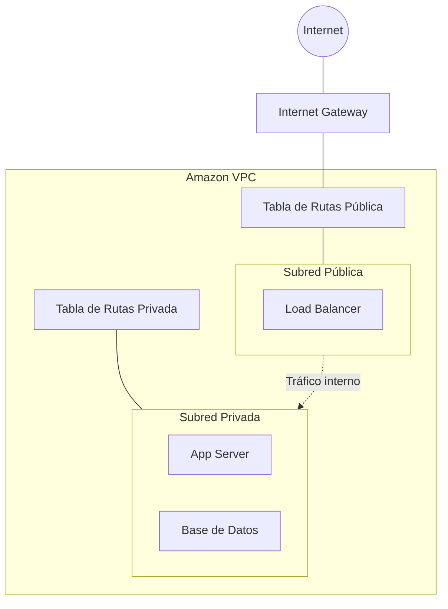
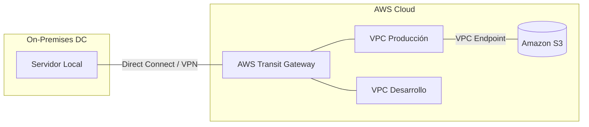

# Módulo 08: Redes en AWS (Sesión 2 — Parte 1)

## 📅 Metadatos y Objetivos
- **Tiempo estimado:** 25-30 minutos
- **Audiencia:** Estudiantes de TI con bases en redes y virtualización.
- **Objetivos de aprendizaje:**
    - Diseñar arquitecturas de red privadas y segmentadas mediante **Amazon VPC**.
    - Implementar mecanismos de seguridad granular (SG y NACL) bajo el principio de menor privilegio.
    - Seleccionar el modelo de conectividad adecuado para escenarios híbridos y multi-red.

---

## 8.1 🌐 Introducción a Redes en la Nube
En el Módulo 02 vimos la anatomía física de un Data Center. En la nube, esa infraestructura física no desaparece, pero se **abstrae** mediante software.

### 🧩 Software Defined Networking (SDN)
Las redes en AWS son **redes definidas por software**. Esto significa que:
*   **Abstracción:** No necesitas configurar cables, racks o switches físicos.
*   **Flexibilidad:** Los recursos de red se crean, modifican y eliminan mediante API o comandos (IaC).
*   **Escalabilidad:** Se puede escalar la infraestructura de red globalmente en minutos, algo imposible en un modelo tradicional.

---

## 8.2 🏗️ Amazon Virtual Private Cloud (VPC)
**Amazon VPC** es tu sección lógicamente aislada de la red en la nube de AWS. Es el contenedor de todos tus recursos de red.

### 1. Definición y Aislamiento
Una VPC te otorga control total sobre tu entorno de red virtual, incluyendo la selección de tu propio rango de direcciones IP, la creación de subredes y la configuración de tablas de enrutamiento y firewalls.

### 2. Segmentación: Subredes Públicas y Privadas
Una VPC se divide en **subredes**, que son rangos de direcciones IP dentro de la VPC.

*   **Subred Pública:** Tiene acceso directo a Internet. Se utiliza para recursos expuestos externamente, como balanceadores de carga o servidores web.
*   **Subred Privada:** No tiene acceso directo desde Internet. Se utiliza para recursos críticos y bases de datos que requieren aislamiento.

### 3. El Mapa de Tráfico: Tablas de Enrutamiento
Las **Tablas de Enrutamiento** contienen un conjunto de reglas (llamadas rutas) que se utilizan para determinar hacia dónde se dirige el tráfico de red de tu subred o gateway.

---

## 8.3 🚪 Gateways y Direccionamiento
Para que los recursos se comuniquen dentro y fuera de la VPC, utilizamos componentes específicos:

### 1. Conectividad a Internet
*   **Internet Gateway (IGW):** Un componente horizontalmente escalable, redundante y de alta disponibilidad que permite la comunicación entre los recursos de las subredes públicas e Internet.
*   **NAT Gateway:** Permite que las instancias en una **subred privada** se conecten a Internet (para actualizaciones, por ejemplo), pero evita que Internet inicie una conexión con esas instancias.
*   **Egress-Only IGW:** Similar al NAT Gateway, pero diseñado específicamente para tráfico **IPv6** saliente.

### 2. Direccionamiento IP
*   **CIDR Blocks:** Rango de direcciones IP privadas definidas al crear la VPC (ej. `10.0.0.0/16`).
*   **IPv4 Pública:** Dirección dinámica asignada por AWS que permite el acceso desde Internet.
*   **Elastic IP (EIP):** Dirección IPv4 estática diseñada para la computación en la nube dinámica. Se asocia a tu cuenta, no a la instancia, y persiste aunque la instancia se detenga.

---

## 8.4 🔒 Seguridad de Red: Defensa en Profundidad
La seguridad en una VPC es una combinación de dos mecanismos fundamentales:

| Característica | Security Groups (SG) | Network ACLs (NACL) |
| :--- | :--- | :--- |
| **Nivel de Acción** | Instancia (vNIC) | Subred |
| **Estado (Stateful)** | **Sí**: Si permites entrada, la salida vuelve automáticamente. | **No**: Debes configurar reglas de entrada y salida explícitamente. |
| **Reglas** | Solo reglas de Permitir (*Allow*). | Reglas de Permitir y Denegar (*Allow/Deny*). |
| **Orden** | Se evalúan todas las reglas. | Se evalúan por número de regla (en orden). |

> [!IMPORTANT]
> **Principio de Menor Privilegio:** Abre solo los puertos estrictamente necesarios (ej. 443 para HTTPS) y restringe el tráfico de origen tanto como sea posible.

---

## 8.5 🔗 Conectividad Avanzada e Híbrida
AWS ofrece múltiples formas de conectar redes entre sí o con infraestructuras externas.

### 1. VPC Peering
Conexión de red entre dos VPCs que permite enrutar el tráfico entre ellas utilizando direcciones IP privadas. El tráfico no pasa por la red pública de Internet.

### 2. Conectividad Híbrida (On-Premise a AWS)
*   **AWS VPN:** Conexión cifrada a través de la Internet pública. Rápida de desplegar pero sujeta a la variabilidad de la Internet.
*   **AWS Direct Connect:** Conexión de red dedicada desde tu centro de datos a AWS. Proporciona ancho de banda constante y latencia predecible.

### 3. AWS Transit Gateway
Un hub de tránsito de red que puedes usar para interconectar tus VPCs y tus redes on-premise de forma centralizada, evitando la complejidad de una red de peering "malla completa" (*full mesh*).

### 4. VPC Endpoints y PrivateLink
Permiten conectar tu VPC de forma privada a servicios de AWS (como S3) y servicios de terceros, sin necesidad de un IGW, NAT Gateway o VPN. El tráfico nunca sale de la red de AWS.

---

## 🧠 Puntos de Retención
*   **VPC** es aislamiento; **Subredes** son la segmentación interna.
*   **IGW** para el mundo; **NAT Gateway** para salida segura desde la sombra (privada).
*   **Security Groups** son tu firewall personal (instancia); **NACLs** son el guardia de la puerta del edificio (subred).
*   **Transit Gateway** simplifica la gestión de redes complejas a gran escala.
*   **PrivateLink** mantiene el tráfico de los servicios dentro de la casa (red privada de AWS).

---

## 🔒 Perspectiva de Seguridad: Aislamiento por Capas
Diseña tus redes asumiendo que el perímetro puede fallar. Coloca tus bases de datos en la subred más profunda (privada), permitiendo solo tráfico desde la capa de aplicación y bloqueando cualquier otro intento de acceso.
