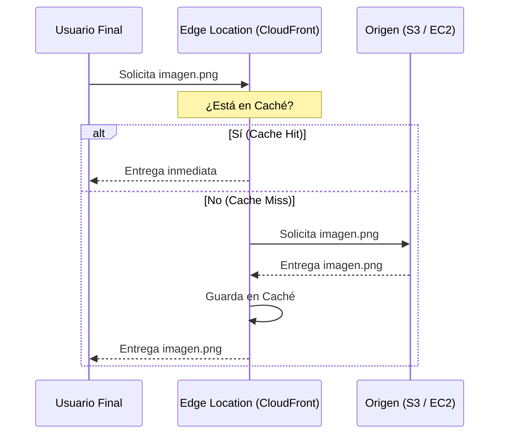
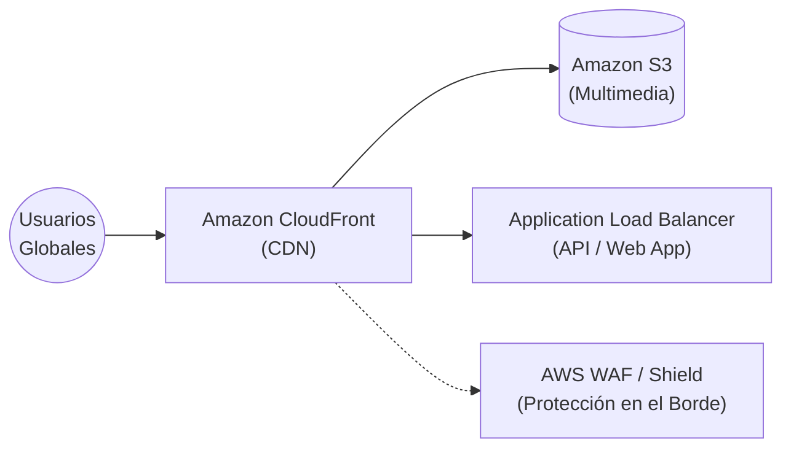

# Módulo 09: Entrega de Contenido y Edge (Sesión 2 — Parte 2)

## 📅 Metadatos y Objetivos
- **Tiempo estimado:** 20-25 minutos
- **Audiencia:** Estudiantes de TI interesados en rendimiento y escalabilidad global.
- **Objetivos de aprendizaje:**
    - Gestionar resoluciones de nombres de dominio mediante **Amazon Route 53**.
    - Implementar estrategias de enrutamiento para alta disponibilidad.
    - Optimizar la entrega de contenido estático y dinámico mediante una CDN (**Amazon CloudFront**).

---

## 9.1 🗺️ Amazon Route 53
**Amazon Route 53** es un servicio de Sistema de Nombres de Dominio (DNS) web altamente disponible y escalable.

### 🧩 Fundamentos de DNS Administrado
Route 53 hace más que solo traducir nombres (ej. `www.google.com`) a direcciones IP (ej. `142.250.190.46`). Proporciona tres funciones principales:
1.  **Registro de dominios:** Compra de nombres de dominio.
2.  **Enrutamiento DNS:** Envío de tráfico a recursos de AWS o externos.
3.  **Comprobaciones de estado (Health Checks):** Monitoreo de la salud de tus aplicaciones para evitar enviar tráfico a servidores caídos.

### 🚦 Políticas de Enrutamiento
Las políticas determinan cómo Route 53 responde a las consultas DNS:

| Política | Cuándo usarla |
| :--- | :--- |
| **Simple Routing** | Un solo recurso para tu dominio (ej. una sola IP). |
| **Weighted Routing** | Enviar tráfico a múltiples recursos en proporciones definidas (ej. 80% azul, 20% verde). |
| **Latency-based Routing** | Enviar al usuario a la región de AWS que proporcione la menor latencia. |
| **Failover Routing** | (Activo-Pasivo) Si el recurso principal falla, el tráfico se dirige automáticamente al secundario. |
| **Geolocation/Geoproximity** | Enviar tráfico basado en la ubicación física del usuario. |

---

## 9.2 🚀 Amazon CloudFront
**Amazon CloudFront** es una red de entrega de contenido (CDN) rápida que entrega datos, videos, aplicaciones y APIs a usuarios de todo el mundo con baja latencia y altas velocidades de transferencia.

### 🌍 La Infraestructura Global de Borde
CloudFront utiliza la infraestructura de borde vista en el Módulo 04:
*   **Edge Locations:** Puntos de presencia donde se cachea el contenido.
*   **Regional Edge Caches:** Una capa intermedia para optimizar la retención de la caché.

### 🧩 Beneficios y Funcionalidades
1.  **Caché de contenido:** Reduce la carga en tus servidores de origen y acelera la entrega.
2.  **Baja latencia:** El contenido viaja desde una ubicación físicamente cercana al usuario.
3.  **Seguridad integrada:** Protección contra ataques DDoS (AWS Shield) y filtrado a nivel de aplicación (AWS WAF) en el borde.
4.  **Terminación SSL/TLS:** El apretón de manos cifrado ocurre más cerca del usuario, mejorando el rendimiento.

---

## 🔗 9.3 Integración y Casos de Uso
CloudFront actúa como una "fachada" para diversos servicios de origen:

*   **Almacenamiento (Amazon S3):** Sitio web estático o repositorio de multimedia.
*   **Cómputo (EC2 / Load Balancers):** Aceleración de APIs dinámicas.
*   **Seguridad y Lógica (Lambda@Edge):** Ejecución de código pequeño en las propias Edge Locations para personalizar el contenido por usuario.

---

## 🧠 Puntos de Retención
*   **Route 53** gestiona el nombre; **CloudFront** gestiona la entrega del contenido.
*   El **Failover Routing** es clave para arquitecturas de Recuperación ante Desastres (DR).
*   **Edge Locations** son el secreto de la baja latencia en la nube.
*   Usar CloudFront con S3 mejora la seguridad, permitiendo que el bucket sea privado y solo accesible vía CDN.

---

## 🔒 Perspectiva de Seguridad: Protección en la Periferia
CloudFront no es solo rendimiento. Al ser la primera línea de contacto con el usuario, permite detener ataques de inundación (DDoS) o inyecciones maliciosas antes de que lleguen a tu VPC, protegiendo tus recursos más sensibles.
