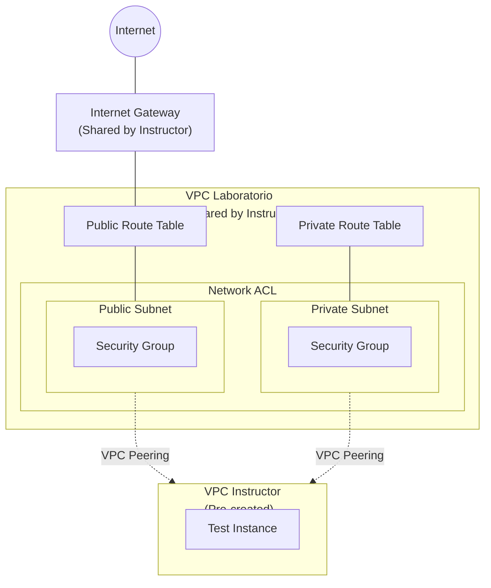

# Laboratorio 1: Arquitectura de Red Privada en AWS

## ⏱️ Duración del laboratorio: 40 minutos

---

## 🎯 Objetivo del Laboratorio
El objetivo de este laboratorio es que construyas una **arquitectura básica de red en AWS** utilizando los componentes fundamentales de **Amazon VPC**. 

Aprenderás a segmentar tu red creando subredes (públicas y privadas), a controlar el flujo de tráfico con tablas de enrutamiento y a aplicar reglas de control de acceso utilizando Security Groups y Network ACLs. Finalmente, conectarás tu red con otra red existente utilizando VPC Peering. Esta arquitectura servirá como base para los siguientes laboratorios donde desplegarás aplicaciones reales.

---

## 🏗️ Arquitectura del Laboratorio

---

## 📋 Pasos del Laboratorio

> [!IMPORTANT]
> **Requisito del Idioma:** Asegúrate de que tu AWS Management Console esté configurada en **English (US)**, ya que todas las instrucciones de esta guía utilizan los términos oficiales de AWS en inglés.

---

### Paso 1: Demostración en vivo del Instructor (Recursos Compartidos)
Para que puedas enfocarte directamente en la segmentación de red, el instructor realizará una demostración en vivo de la creación de la infraestructura base.

**El instructor realizará los siguientes pasos:**
1.  En el servicio **VPC**, hará clic en **Your VPCs** y luego en **Create VPC**.
2.  Configurará la VPC (ej. **Name tag:** `shared-vpc`, **IPv4 CIDR:** `10.0.0.0/16`) y hará clic en **Create VPC**.
3.  En el menú lateral, seleccionará **Internet Gateways** y hará clic en **Create internet gateway**.
4.  Asignará un nombre (ej. `shared-igw`) y hará clic en **Create internet gateway**.
5.  Seleccionará el IGW recién creado y, en **Actions**, hará clic en **Attach to VPC** para vincularlo a la `shared-vpc`.

> [!NOTE]
> Presta atención al **VPC ID** resultante (ej. `vpc-01234abcd...`) que el instructor mostrará en pantalla, ya que será indispensable para ubicar tus subredes en el siguiente paso.

---

### Paso 2: Creación de Subredes Pública y Privada

Vamos a segmentar la VPC compartida en dos zonas: una pública (con posible acceso a Internet) y una privada (aislada de accesos directos desde Internet).

1.  En la barra de búsqueda superior, escribe **VPC** y selecciona el servicio **VPC**.
2.  En el menú lateral izquierdo, haz clic en **Subnets**.
3.  Haz clic en el botón naranja **Create subnet**.
4.  En **VPC ID**, selecciona la VPC compartida por el instructor.
5.  Configura la **Subred Pública**:
    *   **Subnet name:** `public-subnet-[tu-nombre]`
    *   **Availability Zone:** Elige la primera opción disponible (ej. *us-east-1a*).
    *   **IPv4 CIDR block:** Asigna un bloque pequeño, ej. `10.0.1.0/24`.
6.  Haz clic en el botón **Add new subnet** en la parte inferior para crear la segunda subred en la misma pantalla.
7.  Configura la **Subred Privada**:
    *   **Subnet name:** `private-subnet-[tu-nombre]`
    *   **Availability Zone:** Elige la misma zona que en el paso 5.
    *   **IPv4 CIDR block:** Asigna otro bloque distinto, ej. `10.0.2.0/24`.
8.  Haz clic en **Create subnets**.
9.  Para la subred pública, queremos que asigne IPs públicas automáticamente a lo que lancemos ahí. Selecciona tu ruta `public-subnet-[tu-nombre]` de la lista, haz clic en **Actions** > **Edit subnet settings**. Marca la casilla **Enable auto-assign public IPv4 address** y haz clic en **Save**.

---

### Paso 3: Configuración de Tablas de Enrutamiento

Actualmente, tus subredes no saben cómo llegar a Internet. Debemos crear una ruta.

1.  En el menú lateral izquierdo de VPC, haz clic en **Route tables**.
2.  Haz clic en **Create route table**.
3.  **Name:** `public-rt-[tu-nombre]`.
4.  **VPC:** Selecciona la VPC compartida.
5.  Haz clic en **Create route table**.
6.  Una vez creada, en la pestaña inferior selecciona **Routes** y luego haz clic en **Edit routes**.
7.  Haz clic en **Add route**.
8.  En **Destination**, ingresa `0.0.0.0/0` (esto significa "cualquier lugar en Internet").
9.  En **Target**, selecciona **Internet Gateway** y elige el IGW compartido por el instructor.
10. Haz clic en **Save changes**.
11. Ahora debemos asociar esta tabla a tu subred pública. Ve a la pestaña **Subnet associations** (todavía dentro de tu Route Table), y haz clic en **Edit subnet associations**.
12. Marca la casilla junto a tu `public-subnet-[tu-nombre]` y haz clic en **Save associations**.

> [!TIP]
> Tu **Subred Privada** utilizará la tabla de enrutamiento principal (*Main*) por defecto, la cual no tiene una ruta hacia el Internet Gateway (0.0.0.0/0). Esto garantiza que permanezca aislada de Internet.

---

### Paso 4: Creación de un Security Group (Firewall Stateful)

Vamos a crear un firewall a nivel de instancia que permita tráfico básico web y de administración.

1.  En el menú lateral izquierdo de VPC (desplázate hacia abajo en la sección de Security), haz clic en **Security groups**.
2.  Haz clic en **Create security group**.
3.  **Security group name:** `web-sg-[tu-nombre]`.
4.  **Description:** `Allow http and ssh access`.
5.  **VPC:** Selecciona la VPC compartida.
6.  En **Inbound rules**, haz clic en **Add rule**:
    *   **Type:** `HTTP`
    *   **Source:** `Anywhere-IPv4` (`0.0.0.0/0`)
7.  Haz clic en **Add rule** nuevamente:
    *   **Type:** `SSH`
    *   **Source:** Idealmente tu IP (`My IP`), pero para fines del lab puedes usar `Anywhere-IPv4`.
8.  Notarás que en **Outbound rules** ya hay una regla que permite "All traffic". Déjala así (*Stateful*).
9.  Haz clic en **Create security group**.

---

### Paso 5: Creación de un Network ACL (Firewall Stateless)

Añadiremos una capa de protección a nivel de la subred.

1.  En el menú lateral izquierdo, haz clic en **Network ACLs**.
2.  Haz clic en **Create network ACL**.
3.  **Name:** `lab-nacl-[tu-nombre]`.
4.  **VPC:** Selecciona la VPC compartida y haz clic en **Create network ACL**.
5.  Selecciona tu nuevo NACL de la lista y ve a la pestaña **Inbound rules**. Haz clic en **Edit inbound rules**.
6.  Haz clic en **Add new rule**:
    *   **Rule number:** `100` (El número define la prioridad).
    *   **Type:** `All traffic`
    *   **Source:** `0.0.0.0/0`
    *   **Allow/Deny:** `Allow`
7.  Haz clic en **Save changes**.
8.  Ve a la pestaña **Outbound rules** y repite el proceso: **Rule 100**, **All traffic**, **Destination 0.0.0.0/0**, **Allow**.
9.  Finalmente, asóciala a tu subred. Ve a la pestaña **Subnet associations**, haz clic en **Edit subnet associations**, selecciona **ambas** subredes que creaste (Public y Private) y dale a **Save changes**.

---

### Paso 6: Configuración de VPC Peering

Vamos a solicitar una conexión de red privada hacia una VPC que el instructor ya había creado en una sesión anterior.

**Requiring: Peering Connection**
1.  En el menú lateral izquierdo, selecciona **Peering connections**.
2.  Haz clic en **Create peering connection**.
3.  **Name:** `peer-to-instructor-[tu-nombre]`.
4.  **VPC ID (Requester):** Selecciona la VPC compartida donde estás trabajando.
5.  **Select another VPC to peer with (Accepter):** 
    *   **Account:** `My account` (a menos que el instructor indique otra).
    *   **Region:** `This region`.
    *   **VPC ID (Accepter):** Selecciona el ID de la VPC del instructor (el instructor proveerá este ID, ej. `vpc-instructor123...`).
6.  Haz clic en **Create peering connection**.

    **Aceptación y Enrutamiento**
7.  Selecciona tu conexión de peering recién creada. En la parte superior derecha, haz clic en **Actions** > **Accept request** (En un escenario real, el dueño de la otra VPC debe aceptar. Aquí lo haces tú mismo si es la misma cuenta). Confirma haciendo clic en **Accept request**.
8.  Ahora, para que el tráfico fluya, debes **actualizar tus tablas de enrutamiento**. Ve de nuevo a **Route tables**.
9.  Selecciona tu `public-rt-[tu-nombre]`, ve a **Routes** > **Edit routes** > **Add route**:
    *   **Destination:** El bloque CIDR de la VPC del instructor (ej. `192.168.0.0/16` - pregunta al instructor).
    *   **Target:** `Peering Connection` -> Selecciona la conexión que acabas de crear.
10. Haz clic en **Save changes**. Repite este paso 9 y 10 para tu **Tabla de rutas Privada** (buscando la que está asociada a tu subnet privada) si deseas que pueda alcanzar la red del instructor.

---

## ✅ Validación Final
Si lograste configurar las subredes, crear las tablas de enrutamiento, establecer el Security Group, el NACL y aceptar el VPC Peering, has completado exitosamente la arquitectura de red base. En el siguiente laboratorio, lanzarás máquinas virtuales dentro de esta red.
