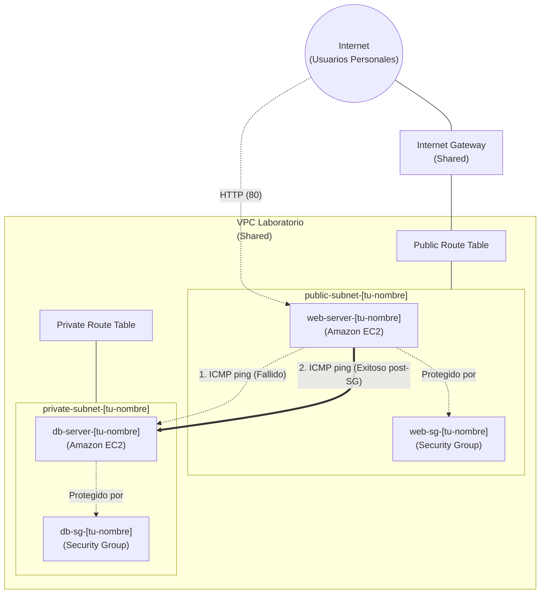

# Laboratorio 2: Despliegue de Servidor Web en EC2 y Conectividad entre Instancias

## ⏱️ Duración del laboratorio: 40 minutos

---

## 🎯 Objetivo del Laboratorio
El objetivo de este laboratorio es implementar una **aplicación web simple** sobre la arquitectura de red que creaste en el Laboratorio 1. 

Aprenderás a lanzar instancias **Amazon EC2** en subredes públicas y privadas. Automatizarás la configuración de un servidor web utilizando **User Data**, validarás su exposición a Internet, y finalmente configurarás las reglas de seguridad strictas (Security Groups) basadas en el principio del **mínimo privilegio** para probar y permitir la conectividad interna entre tus servidores.

---

## 🏗️ Arquitectura del Laboratorio



---

## 📋 Pasos del Laboratorio

> [!IMPORTANT]
> **Requisito del Idioma:** Asegúrate de que tu AWS Management Console esté configurada en **English (US)**.

---

### Paso 1: Preparación (Localización de la Red Base)
Antes de lanzar servidores, debes tener claro dónde los vas a colocar. Necesitarás usar exactamente los recursos creados en el laboratorio anterior.

1.  Asegúrate de tener anotados los nombres exactos de tu `public-subnet-[tu-nombre]`, tu `private-subnet-[tu-nombre]`, y tu `web-sg-[tu-nombre]`.

---

### Paso 2: Lanzamiento del Servidor Web (EC2 en Subred Pública)

Lanzaremos un servidor expuesto a Internet y lo configuraremos automáticamente con un script en el inicio.

1.  En la barra de búsqueda, escribe **EC2** y selecciona el servicio **EC2**.
2.  En el panel izquierdo, haz clic en **Instances**, y luego en el botón naranja **Launch instances**.
3.  **Name and tags:** Escribe `web-server-[tu-nombre]`.
4.  **Application and OS Images (Amazon Machine Image):** Selecciona **Amazon Linux 2023 AMI** (la que dice *Free tier eligible*).
5.  **Instance type:** Asegúrate de que **t3.micro** esté seleccionado (*Free tier eligible*).
6.  **Key pair (login):** Selecciona **Proceed without a key pair (Not recommended)**. Para este laboratorio práctico, utilizaremos el acceso web directo, no SSH tradicional con llaves (o usa una llave si tu instructor lo prefiere).
7.  En la sección **Network settings**, haz clic en el botón **Edit** a la derecha:
    *   **VPC:** Selecciona la VPC compartida (`shared-vpc`).
    *   **Subnet:** Selecciona tu **`public-subnet-[tu-nombre]`**.
    *   **Auto-assign public IP:** Asegúrate de que esté en **Enable**.
    *   **Firewall (security groups):** Selecciona **Select existing security group**.
    *   **Common security groups:** Selecciona tu firewall web previamente creado: `web-sg-[tu-nombre]`.

### Paso 3: Inyección del Script (User Data)
Todavía en la pantalla de lanzamiento de la instancia, vamos a decirle al servidor qué instalar al encender por primera vez.

1.  Desplázate hasta el final y expande la sección **Advanced details**.
2.  Desplázate hacia abajo hasta el cuadro de texto de **User data**.
3.  Copia y pega el contenido del archivo **[user-data.sh](user-data.sh)**. 

> [!IMPORTANT]
> Al pegar el contenido, asegúrate de cambiar la línea donde dice `PARTICIPANTE="[Tu Nombre]"` por tu nombre real para que el sitio web se genere correctamente.

4.  Haz clic en el botón naranja **Launch instance** a la derecha.

### Paso 4: Validación de Acceso HTTP
Comprobaremos que la automatización sirvió el sitio correctamente.

1.  Haz clic en **View all instances**.
2.  Espera hasta que el **Instance state** de tu `web-server-[tu-nombre]` cambie a **Running** (puede tomar unos minutos mientras instala Apache).
3.  Selecciona tu instancia marcando la casilla izquierda.
4.  En la pestaña inferior **Details**, copia el valor de **Public IPv4 address**.
5.  Abre una nueva pestaña en tu navegador, pega la IP pública obtenida y presiona Enter.

> [!NOTE]
> Debes ver tu sitio web personalizado indicando tu nombre, IPs y zona. Si no carga, verifica que tu `web-sg-[tu-nombre]` del Lab 1 tiene el puerto 80 (HTTP) abierto al `0.0.0.0/0`.

---

### Paso 5: Lanzamiento del Servidor de Base de Datos (EC2 en Subred Privada)

Ahora lanzaremos un servidor interno que simularemos como base de datos. No debe ser accesible desde Internet.

1.  Regresa a la consola de EC2 y haz clic en **Launch instances**.
2.  **Name and tags:** Escribe `db-server-[tu-nombre]`.
3.  **Application and OS Images:** Amazon Linux 2023 AMI.
4.  **Instance type:** t3.micro.
5.  **Key pair:** **Proceed without a key pair**.
6.  En **Network settings**, haz clic en **Edit**:
    *   **VPC:** Selecciona la compartida (`shared-vpc`).
    *   **Subnet:** Cuidado aquí. Selecciona tu **`private-subnet-[tu-nombre]`**.
    *   **Auto-assign public IP:** Asegúrate de que esté en **Disable** (Las subredes privadas no deben tener IPs expuestas).
    *   **Firewall:** Selecciona **Create security group**.
    *   **Security group name:** Escribe `db-sg-[tu-nombre]`.
    *   **Description:** `Private SG for database`.
    *   *Nota: Elimina la regla SSH por defecto haciendo clic en "Remove", dejaremos este Security Group sin reglas de entrada por ahora.*
7.  Haz clic en **Launch instance**.
8.  Ve a **View all instances**. Selecciona tu `db-server-[tu-nombre]` y anota su **Private IPv4 address** (ej. `10.0.2.xx`).

---

### Paso 6: Prueba Inicial de Conectividad (El fallo esperado)

Vamos a entrar a nuestro servidor web e intentar contactar a nuestro servidor de base de datos mediante un "ping".

1.  Selecciona tu `web-server-[tu-nombre]` y haz clic en **Connect** en la parte superior.
2.  En la pestaña **EC2 Instance Connect**, deja todo por defecto y haz clic en **Connect**. Se abrirá una terminal en tu navegador.
3.  En la terminal oscura, ejecuta el siguiente comando para probar conectividad usando la IP privada de tu base de datos (cámbiala por la IP que anotaste en el Paso 5.8):
    ```bash
    ping 10.0.2.XX
    ```
4.  Notarás que la terminal se queda pensando o bloqueada. La respuesta es nula.
5.  Presiona `Ctrl + C` para detener el comando de ping.
6.  *¿Por qué falla?* Porque el Security Group de tu base de datos (`db-sg-[tu-nombre]`) fue creado sin reglas de entrada, por lo que bloquea todo el tráfico por defecto.

---

### Paso 7: Ajuste de Seguridad de la Base de Datos (Mínimo Privilegio)

Aplicaremos el principio del mínimo privilegio: Solo permitiremos que el tráfico originado *específicamente* desde nuestro servidor web pueda alcanzar nuestra base de datos.

1.  En la consola de AWS, ve al menú lateral izquierdo, haz clic en **Security Groups** (bajo Network & Security).
2.  Busca y selecciona tu `db-sg-[tu-nombre]`.
3.  En la pestaña inferior, selecciona **Inbound rules** y haz clic en **Edit inbound rules**.
4.  Haz clic en **Add rule**:
    *   **Type:** Selecciona **All ICMP - IPv4** (El protocolo usado por el comando `ping`).
    *   **Source:** Selecciona **Custom**. En la barra de búsqueda que aparece al lado, **busca tu `web-sg-[tu-nombre]`** y selecciónalo.
5.  Haz clic en **Save rules**.

> [!IMPORTANT]
> Lo que acabas de hacer es encadenar Security Groups. Has indicado: "Permitir hacer ping *únicamente* a las instancias que tengan asociado mi grupo de seguridad público de la web". El resto de las IPs de todo el mundo seguirán bloqueadas.

---

### Paso 8: Validación Final de Conectividad

1.  Regresa a la pestaña del navegador donde tenías abierta terminal de **EC2 Instance Connect** (conectada a tu `web-server`).
2.  Vuelve a ejecutar exactamente el mismo comando:
    ```bash
    ping 10.0.2.XX
    ```
3.  Ahora deberías ver respuestas inmediatas: `64 bytes from 10.0.2.XX: icmp_seq=1 ttl=255 time=0.4 ms`. Tu ajuste de seguridad fue un éxito.
4.  Presiona `Ctrl + C` para detenerlo. Has establecido y estructurado conectividad segura (interna) con AWS Networking.

---

## ✅ Conclusión del Laboratorio
Has logrado desplegar recursos en la red que diseñaste previamente. Demostraste el valor que tiene el User Data para automatizar despliegues de la capa pública, y posteriormente comprobaste de forma empírica y a bajo nivel (ICMP Ping command) cómo los Security Groups actúan interceptando todo el tráfico hasta que defines granularmente una excepción bajo el principio de menor privilegio.
