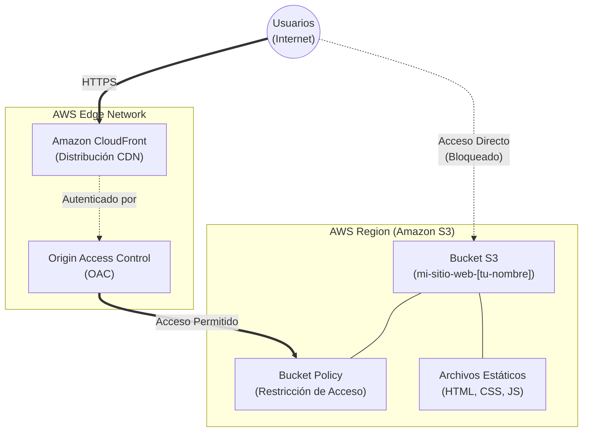

# Laboratorio 3: Hosting de sitio web estático con S3 y CloudFront

## ⏱️ Duración del laboratorio: 30 minutos

---

## 🎯 Objetivo del Laboratorio
El objetivo de este laboratorio es demostrar cómo implementar una **arquitectura serverless básica para el alojamiento de sitios web estáticos** utilizando **Amazon S3** y **Amazon CloudFront**.

Aprenderás a crear un bucket en S3, exponerlo como un servidor web de archivos estáticos y, finalmente, proteger y escalar la distribución global de tu contenido utilizando una Red de Entrega de Contenido (CDN) y controles de acceso restrictivos.

---

## 🏗️ Arquitectura del Laboratorio



---

## 📋 Pasos del Laboratorio

> [!IMPORTANT]
> **Requisito del Idioma:** Asegúrate de que tu AWS Management Console esté configurada en **English (US)**.
> **Archivos Requeridos:** Antes de iniciar, descarga a tu computadora los archivos ubicados en la carpeta `website/` de este laboratorio (index.html, nosotros.html, estilos y scripts).

---

### Paso 1: Creación del bucket de Amazon S3
Primero, crearemos el contenedor donde vivirá tu sitio web.

1. En la barra de búsqueda superior, escribe **S3** y selecciona el servicio **S3**.
2. En el menú izquierdo, haz clic en **Buckets** y luego en el botón naranja **Create bucket**.
3. **General configuration:**
   * **Bucket name:** Escribe `mi-sitio-web-[tu-nombre]-[numero-aleatorio]` (Debe ser único en todo el mundo y en minúsculas).
   * **AWS Region:** Selecciona la región actual del taller (ej. `us-east-1`).
4. En **Object Ownership**, deja la opción recomendada: **ACLs disabled**.
5. En la sección **Block Public Access settings for this bucket**:
   * **Desmarca** la casilla principal que dice **Block all public access**.
   * *AWS mostrará una advertencia amarilla. Marca la casilla inferior para reconocer y aceptar ("I acknowledge that the current settings...")*. 
6. Deja las demás configuraciones por defecto y haz clic en **Create bucket** al fondo de la página.

> [!NOTE]
> Es una excelente práctica de seguridad que S3 bloquee todo el acceso público por defecto. Para que S3 actúe como un servidor web público temprano en el laboratorio, temporalmente debemos levantar esa barrera de protección.

---

### Paso 2: Carga de material estático
Vamos a llenar tu bucket con los archivos del sitio web.

1. Haz clic en el nombre del bucket que acabas de crear.
2. En la pestaña **Objects**, haz clic en el botón naranja **Upload**.
3. Abre en tu computadora la carpeta `website/` que descargaste antes de empezar.
4. Arrastra todos los archivos de contenido (`index.html`, `nosotros.html`, `contacto.html`, `error.html`, `styles/`, `scripts/`, `assets/`) hacia el área de carga en la consola de AWS.
5. Haz clic en el botón **Upload** que se encuentra abajo de todo.
6. Espera a que el progreso muestre "Succeeded" y haz clic en **Close**.

---

### Paso 3: Habilitación de "Static Website Hosting"
Le diremos a S3 que trate este bucket como un servidor web.

1. Dentro de tu bucket, ve a la pestaña **Properties**.
2. Desplázate hasta la última sección (abajo del todo) llamada **Static website hosting**.
3. Haz clic en **Edit**.
4. Selecciona **Enable**.
5. **Hosting type:** `Host a static website`.
6. **Index document:** Escribe `index.html`.
7. **Error document - optional:** Escribe `error.html`.
8. Haz clic en **Save changes**.
9. Inmediatamente después, desplázate otra vez hasta el fondo y copia el **Bucket website endpoint** generado (un enlace largo). Anótalo pero aún no lo abras.

---

### Paso 4: Comprobación de Acceso (Fallo Esperado)

1. Haz clic o abre en otra pestaña la URL del **Bucket website endpoint** que generaste.
2. La página mostrará un mensaje de error XML: **403 Forbidden**.

> [!IMPORTANT]
> **¿Por qué falló?** Aunque habilitaste la función de website, los objetos dentro del contenedor le pertenecen *solo* tí. Debes escribir expresamente un permiso (Policy) indicando que cualquier persona en Internet puede leerlos.

---

### Paso 5: Configuración de Permisos (Bucket Policy Pública)

1. En la consola de S3 en tu bucket, cambia a la pestaña **Permissions**.
2. Desplázate a la sección **Bucket policy** y haz clic en **Edit**.
3. Copia y pega la siguiente política JSON, que autoriza a cualquiera (`"Principal": "*"`) a obtener objetos (`"s3:GetObject"`) de tu bucket. 
4. **¡ATENCIÓN!** Debes reemplazar `[NOMBRE_DE_TU_BUCKET]` en el bloque "Resource" por el nombre exacto de tu bucket, manteniendo el `/*` al final:

```json
{
    "Version": "2012-10-17",
    "Statement": [
        {
            "Sid": "PublicReadGetObject",
            "Effect": "Allow",
            "Principal": "*",
            "Action": "s3:GetObject",
            "Resource": "arn:aws:s3:::[NOMBRE_DE_TU_BUCKET]/*"
        }
    ]
}
```

5. Haz clic en **Save changes**. Verás que debajo del nombre de tu bucket ahora aparece una gran etiqueta roja alertando **"Publicly accessible"**.

---

### Paso 6: Verificación de acceso HTTP en S3

1. Abre de nuevo la pestaña con el **Bucket website endpoint** o haz clic de nuevo en ese enlace.
2. ¡Felicidades! Ahora podrás visualizar e interactuar por las distintas páginas del portal web desplegado en Serverless AWS.

> [!WARNING]
> Hasta este punto, los usuarios acceden directamente a la región física originaria de S3 sin encriptación (HTTP). Resolvemos esto colocando la red de caché (CDN) CloudFront frente al bucket.

---

### Paso 7: Aceleración Global con CloudFront

1. En la barra de búsqueda de AWS superior, busca y abre **CloudFront**.
2. Haz clic en el botón naranja **Create a CloudFront distribution**.
3. **Origin domain:** Haz clic en la caja de texto y aparecerán tus recursos de AWS. **Selecciona tu bucket de S3** de la lista (ej. `mi-sitio-web...s3.amazonaws.com`).
4. Aparecerá un aviso recomendando la seguridad de origen.
   * En **Origin access**, selecciona **Origin access control settings (recommended)**.
   * Haz clic en el botón **Create control setting**, deja las opciones por defecto y haz clic en **Create**.
5. Baja hasta la sección **Default cache behavior**.
   * En **Viewer protocol policy**, selecciona **Redirect HTTP to HTTPS**.
6. Baja hasta la sección **Web Application Firewall (WAF)**.
   * Selecciona **Do not enable security protections** (para omitir costos en este demo).
7. Baja al final de la página y haz clic en el botón naranja **Create distribution**.

> [!NOTE]
> La distribución puede tardar un par de minutos en copiarse globalmente. En la siguiente pantalla veremos que CloudFront requiere aplicar la política final de seguridad para el bucket de S3.

---

### Paso 8: Restricción Final del Origen (Mínimo Privilegio)

Prohibiremos el acceso directo desde S3 (el viejo Bucket endpoint) a favor de forzar todo el tráfico por CloudFront.

1. Al finalizar de crear la distribución, verás un gran banner amarillo/celeste en la parte superior indicando que debes actualizar la política de tu bucket S3 "The S3 bucket policy needs to be updated".
2. Haz clic en el botón **Copy policy** dentro del banner.
3. Regresa a la pestaña de tu bucket de **Amazon S3**.
4. Ve a la pestaña **Permissions**, baja a **Bucket policy** y haz clic en **Edit**.
5. **Borra por completo la política pública antigua** que pusiste en el Paso 5, y pega la nueva que acabas de copiar de CloudFront (Notarás que solo permite tráfico proveniente del servicio `cloudfront.amazonaws.com`).
6. Haz clic en **Save changes**. La alerta roja "Publicly accessible" desaparecerá inmediatamente.

---

### Paso 9: Validación de la CDN Segura

1. Regresa a CloudFront. Espera a que el estado interno cambie y en *Last modified* ya esté desplegada con fecha actual (ya no dice *Deploying*).
2. Copia el **Distribution domain name** brindado (ej. `d1234abcd.cloudfront.net`).
3. Abre una nueva pestaña, y pega la URL de CloudFront. Tu sitio web estático debe cargar a gran velocidad, esta vez con la seguridad de la encriptación HTTPS Edge.
4. Como demostración de seguridad final, regresa y **refresca** la pestaña donde tenías el viejo "Bucket website endpoint" de S3. **Ahora te devolverá un estado de "403 Forbidden" (Bloqueado)**, dado que CloudFront Edge ahora gestiona exclusivamente el acceso seguro al origen.

---

## ✅ Conclusión del Laboratorio
Has construido exitosamente una **arquitectura Serverless orientada a Frontend** usando estándares empresariales modernos de AWS. Comprobaste en vivo el poder del almacenamiento S3 para archivos estáticos y resolviste retos de escala, accesibilidad remota y seguridad blindando tu origen y acelerando tu tráfico a través de la caché perimetral de CloudFront Edge (OAC).
